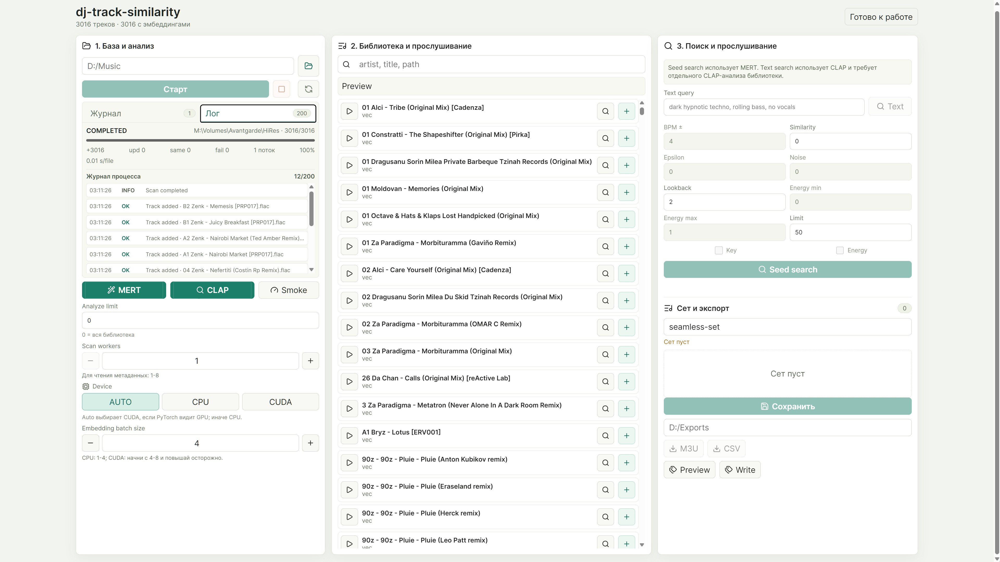

# dj-track-similarity

A personal experiment in building a local music-library tool for finding tracks
that feel close enough to work together in DJ sets.

This repository started as something useful for my own workflow. I collect
music, tag it in my own way, and spend a lot of time thinking about which
tracks can sit next to each other in a set. I am not a professional researcher
or audio engineer; this is an enthusiast project where I am trying ideas,
testing models on a real library, and slowly turning the useful parts into a
tool.

The repository is public because the problem is interesting, and maybe someone
else who collects, tags, or plays music will find the approach useful too.

<p>
  
</p>

## What It Does

- Scans a local music folder and stores track metadata in SQLite.
- Builds audio embeddings with MERT for audio-to-audio similarity search.
- Builds CLAP audio embeddings for text-to-audio search.
- Lets you choose seed tracks, search for similar tracks, preview them, and
  assemble a small set or playlist.
- Exports playlists as M3U or CSV.
- Can preview and write custom `DJ_SIM_*` tags when explicitly requested.

The current focus is simple and practical: check whether modern audio embedding
models can help find tracks that sound related, without relying on BPM, key, or
manually curated genre tags as the main signal.

## Current Status

The project is usable, but still experimental.

MERT already gives promising results on my own library: aggressive broken
tracks tend to pull similar aggressive material, and deeper kick-focused tracks
tend to find related tracks. That is the main reason the project is moving
forward.

The UI currently keeps the search controls conservative:

- `Similarity` sets a minimum cosine score.
- `Lookback` adds the last N tracks from the current set into the search
  context.
- `Limit` caps the number of returned results.

Other controls such as BPM, key, energy, epsilon, and randomization are either
disabled in the UI or treated as future work until they are calibrated properly.
I do not want uncalibrated knobs to make the model look better or worse than it
really is.

## Run The App

```powershell
dj-sim serve --host 127.0.0.1 --port 8765
```

Then open:

```text
http://127.0.0.1:8765/
```

There is also a Windows helper script in this workspace:

```powershell
scripts\run_server.cmd
```

## CLI Examples

```powershell
dj-sim scan "D:\Music"

dj-sim analyze
dj-sim analyze --device cpu --batch-size 2
dj-sim analyze --device cuda --batch-size 8

dj-sim analyze --adapter clap --device cuda --batch-size 4
dj-sim text-search "dark hypnotic techno, rolling bass, no vocals" --limit 50

dj-sim analyze --fake

dj-sim export 1 --format m3u --output-dir "D:\Exports"
dj-sim export 1 --format csv --output-dir "D:\Exports"

dj-sim tag-preview 1 2 3
dj-sim tag-apply 1 2 3
```

`dj-sim analyze` uses `m-a-p/MERT-v1-95M` by default through
PyTorch/Hugging Face and may download model weights on first run.

`--adapter clap` builds separate LAION-CLAP audio embeddings for text search.

`--fake` is only for smoke tests without loading ML models.

In the UI, `Analyze limit = 0` means the whole library. If you only want to test
a few tracks, set a specific integer limit yourself.

## Embedding Spaces

The database can store multiple embedding spaces for the same track:

- `mert`: the main audio-to-audio similarity space.
- `clap`: the LAION-CLAP audio/text space for text search.

These spaces are intentionally not mixed into one matrix. MERT seed search uses
MERT vectors only. CLAP text search compares a CLAP text vector with CLAP audio
vectors only.

That means text search requires a separate CLAP analysis pass before it can
return useful results.

## Text Search

CLAP text search is not metadata filtering. It is an embedding query: the model
tries to place your phrase near audio that matches the description.

Short, concrete prompts usually make the most sense:

```text
dark hypnotic techno, rolling bass, no vocals
deep dub techno, warm chords, soft percussion
broken aggressive industrial sound, dense drums
```

Good query ingredients:

- broad genre or scene words;
- mood and intensity;
- rhythm or drum feel;
- sound texture;
- vocal presence, for example `no vocals` or `female vocal`.

## Performance Notes

MERT and CLAP analysis are accelerated mostly by device selection and inference
batching, not by running many model workers in parallel.

- `auto` uses CUDA when PyTorch can see a GPU, otherwise CPU.
- `cpu` is slower, but useful for compatibility checks.
- `cuda` is usually faster. Start with `batch size 4-8` and raise it carefully.
- `batch size` affects speed and memory use, but should not change the produced
  embeddings because mixed precision is not currently enabled.
- If CUDA is explicitly requested but unavailable, the analysis fails instead
  of silently falling back to CPU. Use `auto` when fallback is desired.

## Safety

- Scanning, analysis, search, preview, and export do not modify audio files.
- `tag-preview` is read-only.
- `tag-apply` writes only custom `DJ_SIM_*` tags and should not overwrite normal
  title, artist, album, BPM, key, or mood fields.

## Roadmap

These are the directions that currently seem most useful, roughly in priority
order:

1. `Search calibration` - inspect real score distributions and choose practical
   defaults for `Similarity`, `Epsilon`, and controlled randomization.
2. `Auto chain` - build a set gradually: seed, find a few close tracks, move the
   context forward, and repeat until the desired limit is reached.
3. `Mel/CNN similarity` - use mel-spectrogram or CNN-style embeddings to capture
   pattern, structure, groove, density, and spectral shape.
4. `Music feature similarity` - add an explainable DSP layer with FFT, MFCC,
   PLP, Mel Spectrogram, Constant-Q Transform, Chroma Features, Spectral
   Centroid, Spectral Rolloff, Spectral Bandwidth, Spectral Flatness, Zero
   Crossing Rate, RMSE, Waveform Envelope, and Autocorrelation.
5. `Hybrid ranking` - combine MERT audio similarity and CLAP text/audio
   similarity in a controlled way after both score ranges are understood.
6. `DJ transition features` - beatgrid, downbeat, phrase structure, loudness,
   real energy, intro/outro spectral balance, vocalness, groove/percussion
   density, and other features that matter specifically for mixing.
7. `MERT model upgrade` - add `m-a-p/MERT-v1-330M` as an optional heavier model
   after the current pipeline is stable.
8. `Scale improvements` - add an ANN index or cached embedding matrix for larger
   libraries.

## Development

Install for development:

```powershell
python -m pip install -e ".[dev]"
```

Install optional ML dependencies:

```powershell
python -m pip install -e ".[ml,dev]"
```

Run backend tests:

```powershell
pytest
```

Build the frontend:

```powershell
cd frontend
npm run build
```
