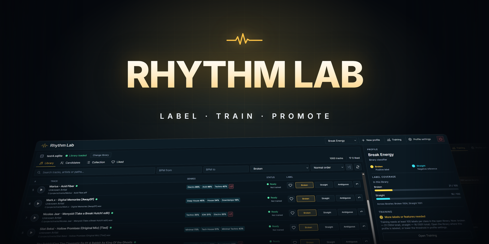

> [!WARNING]
> **⚠️ Early development.** This is a personal enthusiast project under active development. Schemas, commands, defaults, and UI structure change often. Expect incomplete features and breaking changes.

# 🎧 DJTS – DJ Track Similarity

**Build DJ sets as stories from your own local music library.**

<p align="center"></p>

DJTS – `dj-track-similarity` is a local-first workbench for large music folders. It scans them into a SQLite library and runs audio-model analysis on your own machine. Search ranks candidates around seed tracks or text prompts, and the set you assemble by ear exports as M3U or CSV. The server binds to `127.0.0.1` by default, and model assets load only from the local `models/` directory with downloads disabled. Model scores are ranking evidence for listening, not DJ decisions.

---

## ✨ The core idea

Large personal libraries hide music you forgot you own. BPM, key, energy, tags, and crates are the usual DJ toolkit. This project keeps that layer and adds a second one:

1. **Technical compatibility.** BPM, key, duration, energy, and related metadata from SONARA analysis and file tags.
2. **Sonic compatibility.** Rhythm, timbre, density, dynamics, and audio similarity from SONARA features and MAEST, MERT-v2, MuQ, MuQ-MuLan, and CLAP embeddings, plus texture and atmosphere through text prompts.

Nothing in the app orders a set automatically. You seed a search, preview the candidates, add one to the set, seed the next search from it, and shape the story by listening rather than by score. Model outputs are stored separately per model so you can inspect them. The author claims no ML or music-information-retrieval expertise; the background lives in the [project idea](docs/dj-track-similarity/concepts/project-idea.md) page.

---

## ✅ What the project can do today

- **📂 Browse your library.** Scan a local music folder into one SQLite library (tags read with Mutagen), browse it in server-side pages, and listen in the player dock.
- **🎧 Find similar tracks.** Analyze tracks with SONARA, MAEST, MERT-v2, MuQ, MuQ-MuLan, and CLAP, and search from seed tracks with any of those six models.
- **💬 Search by text.** Search from prompt presets with CLAP or MuQ-MuLan, or compare both side by side.
- **🧪 Train personal classifiers.** Use Rhythm Lab to label, train, benchmark, and promote classifiers, then filter the library by their scores in the CLASSIFIER tab.
- **🎚️ Build a set.** Keep a manual current set and export it as M3U or CSV.
- **🧰 Maintain the library.** Check or compact the selected database, and review duplicates found by SONARA fingerprints (see [Maintenance tools](#-maintenance-tools)).

---

## 💾 Installation

> [!IMPORTANT]
> **🪟 Windows x64 and 64-bit PowerShell 7 are required for the supplied installer.** The dependency sources and launchers are configured for this platform. Linux and macOS need adaptation. Codex or Claude Code can help review the project and select compatible packages and launch methods for your system.

> [!WARNING]
> **🎮 GPU analysis needs a compatible NVIDIA GPU and driver.** The selected PyTorch binaries include the **CUDA 13.0 runtime**, so you do not need to install a separate CUDA Toolkit or cuDNN. The installer checks CUDA availability but does not install a graphics driver. See the [NVIDIA CUDA guide for Windows](https://docs.nvidia.com/cuda/archive/13.0.0/cuda-installation-guide-microsoft-windows/index.html), [driver compatibility](https://docs.nvidia.com/deploy/cuda-compatibility/minor-version-compatibility.html), and [PyTorch binary guidance](https://discuss.pytorch.org/t/should-i-install-the-extra-cudatoolkit-and-cudnn/194528). CPU inference is available. CUDA is recommended for full-library ML analysis.
> Have an internet connection and enough free space for **about 10.9 GB of model assets**, plus the Python environment, tools, download caches, and your library database.

> [!TIP]
> **🤖 Installation help:** If installation fails, keep the installer output and ask **Codex or Claude Code** to inspect it together with [AGENTS.md](AGENTS.md), [install.ps1](install.ps1), and the dependency files. Include your OS version, GPU, and driver version so the agent can distinguish a download failure from a runtime or hardware problem.

### 🚀 Install the project

1. Open the [dev branch on GitHub](https://github.com/MeteorBurn/dj-track-similarity/tree/dev), choose **Code → Download ZIP**, and extract the archive.
2. Close running application or server windows. Open the project folder in **PowerShell 7** and run **[install.ps1](install.ps1)**.
3. Wait for installation to finish, then open **[run_server.cmd](run_server.cmd)** for the Web UI.

If PowerShell refuses to run `install.ps1` because it is not digitally signed, Windows has marked the download as coming from the internet. Open the ZIP file's **Properties**, select **Unblock**, and extract it again.

### 📦 What the installer prepares

Package versions and sources follow [pyproject.toml](pyproject.toml), [uv.lock](uv.lock), and [frontend/package-lock.json](frontend/package-lock.json). Compatible tools are reused. The listed tool versions are downloaded when needed.

**🐍 Python and Windows runtime**

- **[Python](https://www.python.org/) 3.10.20** - CPython for the shared environment.
- **[uv](https://docs.astral.sh/uv/) 0.11.12** - Python dependency installation.
- **[Microsoft Visual C++ x64 runtime](https://learn.microsoft.com/en-us/cpp/windows/latest-supported-vc-redist) 14.51.36247.0** - Native runtime DLLs, installed if missing.

**🌐 Web UI and server**

- **[Node.js](https://nodejs.org/en) 24.15.0** - Builds the frontend during installation and serves it at each launch.
- **npm (bundled with Node.js)** - Frontend package installation.
- **React 19.2.5** - Browser interface.
- **Vite 7.3.6** - Builds and serves the browser interface.
- **TypeScript 5.9.3** - Frontend type checking.
- **FastAPI 0.139.0** - Handles local web requests.
- **Uvicorn 0.51.0** - Local server runtime.
- **Pydantic 2.13.4** - Data validation.
- **Typer 0.26.8** - The `dj-sim` command that the launcher uses to start the server.

**🔥 PyTorch and ML runtime**

- **[PyTorch](https://pytorch.org/get-started/previous-versions/) 2.11.0+cu130** - ML inference with CUDA 13.0 binaries.
- **TorchAudio 2.11.0+cu130** - Audio utilities for ML inference.
- **TorchVision 0.26.0+cu130** - Vision utilities for ML dependencies.
- **[TorchCodec](https://github.com/meta-pytorch/torchcodec) 0.16.0+cu130** - Audio decoding for ML.
- **Transformers 5.13.0** - Model loading and inference.
- **Hugging Face Hub 1.22.0** - Model asset handling.

**🔊 Audio**

- **[FFmpeg](https://ffmpeg.org/) 8.1.1 audio shared (LGPL)** - Shared audio libraries, built for this project and shipped in `libs/ffmpeg/`.
- **[PyAV](https://pyav.org/) 17.1.0** - Audio decode recovery, built against those libraries and shipped in `libs/wheels/`.
- **Mutagen 1.48.1** - Audio tags.

**🧮 Numerical and classifier utilities**

- **NumPy 1.26.4** - Numerical processing.
- **SciPy 1.15.3** - Scientific processing.
- **scikit-learn 1.7.2** - Classifiers, feature processing, and the reference map's library scales.
- **joblib 1.5.3** - Model persistence.

**🗂️ Files and reports**

- **Send2Trash 2.1.0** - Sends Audio Dedup deletions to the recycle bin.
- **openpyxl 3.1.5** - Formats XLSX workbooks for the standalone Audio Online metadata tool in `tools/`.

> [!NOTE]
> **🔧 Runtime setup:** FFmpeg shared libraries ship in `libs/ffmpeg/bin/` and need no setup. The installer and application check that folder first, then the DLL folder named by optional `DJTS_FFMPEG`, then `PATH`, skip unusable builds, and report an error if none works. They never launch `ffmpeg.exe` or `ffprobe.exe`. Downloaded portable tools stay inside the project, and the installer does not create `DJTS_FFMPEG` or change your user or system `PATH`.
>
> **🪟 Windows runtime.** Installing the Microsoft runtime may request administrator approval or report that Windows needs a restart. The installer never restarts the computer itself.

### 🎛️ Audio Features Extraction Engine

SONARA engine extracts audio features such as BPM, key, energy, rhythm, timbre, together with an acoustic fingerprint. CPU analysis provides the track data required before ML processing.

The installer includes **SONARA 0.3.6** with decoder patches (RIFF-chunk padding) from the [MeteorBurn/sonara fork](https://github.com/MeteorBurn/sonara/releases/tag/v0.3.6-meteorburn.1). It is installed as a Python package and needs no separate model checkpoint download.

> **📚 Citation:** original [SONARA project by kkollsga](https://github.com/kkollsga/sonara).

### 🧠 Installed models

The installer downloads the ML assets below into `models/` and verifies their SHA-256 hashes. Valid existing files are kept, and interrupted downloads can resume when the server supports it. Analysis reads the local files without automatic model downloads.

| Model | Local assets | Model packages | Approximate size |
| --- | --- | --- | ---: |
| 🧠 [MAEST](https://github.com/palonso/MAEST) | `discogs-maest-30s-pw-129e-519l` checkpoint | **[maest-infer](https://github.com/openmirlab/maest-infer) 0.2.0** - MAEST inference | 0.34 GB |
| 🧠 [MERT-v2-FullSong](https://huggingface.co/m-a-p/MERT-v2-FullSong) | Weights, configuration, and model code | Loaded through Transformers | 2.53 GB |
| 🧠 [MuQ-large-msd-iter](https://huggingface.co/OpenMuQ/MuQ-large-msd-iter) | Weights and configuration | **[muq](https://github.com/tencent-ailab/muq) 0.1.0** - MuQ and MuQ-MuLan inference<br>**nnAudio 0.3.4** - Required by the muq package | 1.33 GB |
| 🧠 [MuQ-MuLan-large](https://huggingface.co/OpenMuQ/MuQ-MuLan-large) | Audio/text assets, including XLM-RoBERTa | **muq 0.1.0** - Shared with MuQ | 3.78 GB |
| 🧠 [CLAP music_audioset](https://huggingface.co/lukewys/laion_clap) | Audio/text assets, including RoBERTa | **[laion-clap](https://github.com/LAION-AI/CLAP) 1.1.7** - CLAP inference | 2.85 GB |
| **💾 Total** | **Downloaded ML assets** | | **10.85 GB** |

> **💾 Size notes.** Sizes use decimal GB and are rounded independently. MuQ-MuLan also uses the MuQ files listed above, counted once in the total.

---

## ▶️ Start the application

### 🖥️ Main application

Open **[run_server.cmd](run_server.cmd)**. There is no default library: the console lists the `.sqlite` files in `database/` and asks `Database [1-N, or a path]:`, or asks `Database path:` when there are none. Enter a number or a path. A new path such as `database/my-library.sqlite` becomes a new library when the server starts. Empty input cancels startup. Then choose the server mode:

```text
Choose server mode:
  1. Local only     http://127.0.0.1:5173/
  2. Local network  http://<this-computer-lan-ip>:5173/
Mode [1/2, default 1]:
```

Press **Enter** or **1** for Local only. Choose **2** only when other devices on your network should connect; the launcher prints your computer's LAN address. Keep the console window open and follow the **Open UI** address it prints. **Ctrl+C** stops the servers. The top-bar power button stops them together with a Rhythm Lab started from the app.

### 🧪 Rhythm Lab

<p align="center"></p>

Prefer the **Rhythm-Lab** button in the main interface. It opens the lab for the selected library at [http://127.0.0.1:8777/](http://127.0.0.1:8777/) as a background process whose log appears in the main server's console. The lab's interface is in English.

For an independent session, open **[run_rhythm-lab.cmd](run_rhythm-lab.cmd)** and select an existing library; this launcher never creates one. If the main application is already running, the launcher hands the request to it. Close an independent lab session before starting the main application, then reopen the lab with its button.

---

## 🧠 First analysis

The analysis panel holds three stage cards: **DATABASE** (scan), **SONARA**, and **ML models**. Check a stage, set the shared **Track limit** (0 means every track), and press **Start**. Each run processes one stage and skips results that already exist. The job status and the log report individual file failures.

1. **Scan.** The DATABASE card's import settings choose the music folder, file formats, and duration bounds.
2. **SONARA.** Before the first run, pick the BPM range in its settings: **Mixed In Key 79–192** (the default), Rekordbox 70–180, VirtualDJ 80–240, or a custom range whose upper bound is at least twice the lower one. The first run locks the range to the library; changing it later requires resetting SONARA analysis.
3. **ML models.** Tick models on the ML models card once SONARA results exist; tracks without SONARA are skipped. The ML settings dialog holds the device (AUTO, CPU, or CUDA), the read mode, and the batch sizes.

Both settings dialogs offer **Direct Mode**, which reads the original files in place, and **Staged Mode**, which can help with slow disks by analyzing temporary copies in a folder you choose. The original audio is unchanged. The music and staging folders are not remembered, so choose them again after each page reload.

On a library created before SONARA stored timelines, SONARA analysis stops with an explicit error about the missing `sonara_timeline` table, and the app never adds that table itself. See [Analyze library](docs/dj-track-similarity/user-guide/analyze-library.md).

---

## 🎚️ Main workflows

The top bar switches workspaces: **DISCOVER** shows the analysis, library, and search panels side by side, **ANALYZE**, **LIBRARY**, and **SEARCH** show one of them, and **EXPORT** shows the current set. It also holds the theme toggle, the log, a stop button for the running stage, and the power button. The main interface mixes Russian and English, and [UI language](docs/dj-track-similarity/help/ui-language.md) maps the labels. Search tabs are LAB (Model Listening Lab), REFERENCE, PROMPT, and CLASSIFIER.

### 1. 🔍 Rediscover your own library

Search by path, title, artist, or genre (LIKE or FTS), show liked tracks, filter by the stored MAEST syncopated-rhythm flag or by classifier scores, and open a track's tags, genres, and analysis. Rows show SONARA BPM and Camelot key. The library has no filter by analysis coverage; the analysis panel shows per-model counts. The player dock streams a preview with seeking, a like button, a repeat toggle, and the track's BPM and key. When a track ends, it repeats or moves on within the current library page. See [Browse library](docs/dj-track-similarity/user-guide/browse-library.md).

### 2. 🎯 Start from a reference track

The REFERENCE tab ranks candidates in one model space per search. SONARA uses measured Core features with a manual mixer of five sliders and nine directional modifiers, and takes up to five seeds. MAEST, MERT-v2, MuQ, MuQ-MuLan, and CLAP each search their own embedding space; for MAEST, MERT-v2, and MuQ you pick one of their stored layers (13, 24, and 13 layers; each family's last layer is the default). The LAB tab shows a short candidate list per model for the first seed, and a saved listening verdict reappears when the same candidate returns for that reference and model. See [Search with seeds](docs/dj-track-similarity/user-guide/search-with-seeds.md).

In the REFERENCE tab, with an embedding model selected, the scatter-chart button next to **Search** opens the reference map: the candidates that **Search** returns for the current references, model, layer, and limit, placed by SONARA measurements alone at their distance from the references across seven facets (rhythm and groove, dynamics, spectrum and texture, timbre, harmony and mode, pitch class, and tempo). Select a candidate to see which facets it keeps or loses, its values beside the references and the library, curves across the whole track, and optional band curves read from the audio, read-only and outside the distance. Another tab summarizes which facets the whole output keeps compared with random library tracks, whether deeper ranks keep them too, and any consistent shift of the output. Model scores never enter the distance, and SONARA's heuristic mood, perceptual, aggression, and vocalness outputs are not read; mood appears only as a labelled reading of measured features. The first map after the server starts, or after the library or its SONARA data changes, calibrates on a library sample, which can take up to a minute. A map stays in browser memory until the library, model, layer, references, or limit change.

### 3. 🌊 Curate the current set

Add results one row at a time, or in bulk from the current library page or every shown REFERENCE or PROMPT candidate. The EXPORT workspace previews and removes set tracks, saves the list as a Rhythm Lab collection, and exports M3U or CSV. The set is in-memory browser state rather than automatic sequencing: switching databases or removing a track from the catalog clears it. See [Export playlists](docs/dj-track-similarity/user-guide/export-playlists.md).

### 4. 💬 Search by text

After CLAP or MuQ-MuLan audio embeddings exist, the PROMPT tab searches your library from a prompt bank built from presets: 45 presets on seven axes, at most one per axis, each worded per model. No preset carries negative prompts, so the **Negatives** switch has nothing to add. A/B runs MuQ-MuLan and CLAP side by side. Approve or reject results to save feedback for that exact query and model; later searches of the same query apply it once at least three usable approvals exist.

The first search loads the text model, which stays cached until about ten minutes pass without a search. Text scores are prompt evidence inside one model's score space and are not comparable to seed-search scores or to the other text model. See [Text search](docs/dj-track-similarity/user-guide/text-search.md).

### 5. 🧪 Train personal classifiers

Rhythm Lab turns listening decisions into classifier scores. Its labels live in `tools/rhythm-lab/database/rhythm_lab.sqlite` and follow the audio through its SONARA fingerprint, even across libraries. The lab can switch libraries while running, except during a profile operation. A new labels database has no built-in profile, so create the one you want to train.

1. Analyze tracks with SONARA, then label examples in Rhythm Lab.
2. Train, benchmark, and review the profile once every class meets its minimum label count.
3. Promote the trained classifier.
4. Score the library from the CLASSIFIER tab, then filter by the scores.

Scoring reads stored analysis, writes results to the database, and skips tracks missing a required input. See [Rhythm Lab](docs/dj-track-similarity/tools-and-scripts/rhythm-lab.md), [Train a personal classifier](docs/dj-track-similarity/workflows/train-personal-classifier.md), and [CLASSIFIER tab](docs/dj-track-similarity/user-guide/class-tab.md).

---

## 🧩 How the pieces fit

```text
audio files -> scan tags -> SQLite library -> browse/search/export
      +---- native SONARA -----------^
      +---- TorchCodec (PyAV recovery) -> ML families ---^
      +---- stored inputs -> classifiers -> CLASSIFIER scores
```

The app never folds evidence into one score scale: a file genre tag, a MAEST genre label, a CLAP text score, and a duplicate score answer different questions ([Similarity scores](docs/dj-track-similarity/concepts/similarity-scores.md)). SONARA stores Core features, a timeline, a 48-dimensional embedding, and an acoustic fingerprint, always together; MAEST adds genre labels, and every ML family keeps its own embedding space. See [Analysis families](docs/dj-track-similarity/reference/analysis-families.md) and [Features, embeddings, and tags](docs/dj-track-similarity/concepts/features-embeddings-tags.md).

---

## 🔗 Upstream models and licenses

Analysis uses upstream projects and downloaded checkpoints: [SONARA](https://github.com/kkollsga/sonara), [MAEST](https://github.com/palonso/MAEST), [MERT-v2](https://huggingface.co/m-a-p/MERT-v2-FullSong), [MuQ and MuQ-MuLan](https://github.com/tencent-ailab/muq), and [LAION CLAP](https://github.com/LAION-AI/CLAP). The repository does not vendor model weights. Upstream code and weights carry different licenses, so check their terms for anything beyond local personal use. See [model citations and licenses](docs/dj-track-similarity/reference/model-citations.md).

---

## 🧰 Maintenance tools

The analysis panel's Tools row holds **Refresh Tags**, **Save Genres**, **Validate DB**, **Rhythm-Lab**, and **Audio Dedup**.

- **🔍 Audio Dedup** finds duplicates across the library from stored SONARA fingerprints alone. **Fingerprints**, the default mode, compares tracks of similar duration. **Fingerprints + LSH** is faster and can match copies of different length, but may miss some pairs. An optional spectrogram analysis, off by default, flags suspected transcodes. Review the report folder by folder, mark copies singly or in bulk, keep a different copy than suggested, and download the report as XLSX. Deletion asks for confirmation, stays inside the folder filter you reviewed, uses the recycle bin by default, rechecks each file, keeps at least one copy per group, and removes deleted copies from the library. See [Audio Dedup](docs/dj-track-similarity/tools-and-scripts/audio-dedup.md).
- **✅ Validate DB** checks SQLite integrity, track identities and files, SONARA Core, fingerprint, and embedding rows, and ML embeddings without changing the library. It skips SONARA timelines, MAEST genres, and classifier scores, and checks only the default layer of MAEST (13), MERT-v2 (24), and MuQ (13).
- **🗃️ Database optimization** is offered after validation reports zero errors. A verified backup protects the database during compaction and index maintenance; it is removed after a verified result and kept if verification fails. See [Optimize database](docs/dj-track-similarity/tools-and-scripts/optimize-database.md).

Starting the app never converts an older database, and the project ships no migration command.

---

## 🛡️ Safety model

Normal workflows read source audio and never modify it. Scan, Refresh Tags, analysis, search, preview, resets, database clear, catalog removal, library relocation, export, and classifier scoring write only SQLite rows, logs, reports, temporary preview or Staged Mode files, and the playlists you export.

Only three workflows touch source audio:

- **🏷️ Save Genres** writes the standard genre field of every track with stored MAEST genres. It starts when you click it, without a confirmation dialog.
- **🩺 Audio Doctor**, a separate command-line tool, rewrites repairable files in place only when told to apply, with a verified backup by default.
- **🗑️ Audio Dedup deletion** removes the copies you marked after a confirmation.

SQLite databases, logs, reports, and promoted classifier artifacts reveal library paths and listening decisions, so `.gitignore` excludes them. [Local-first safety](docs/dj-track-similarity/concepts/local-first-safety.md) holds the full write-path table.

---

## 📚 Documentation

The docs site starts at the [project guide](docs/dj-track-similarity/project-guide.md). It is temporarily unmaintained and may describe older behavior. Use this README for current behavior. Reference pages cover [Configuration](docs/dj-track-similarity/reference/configuration.md), [Database](docs/dj-track-similarity/reference/database.md), [SONARA integration](docs/dj-track-similarity/reference/sonara-integration.md), and [Tools and scripts](docs/dj-track-similarity/tools-and-scripts/index.md).

---

## 🤖 Optional coding-agent setup

The application does not require an agent plugin. For Codex or Claude Code, the shared agents and skills live in [.djts/](.djts/). [AGENTS.md](AGENTS.md) routes project instructions and verification, and [Agent setup](docs/agent-guides/agent-layer.md#agent-layer) explains the optional integration.
