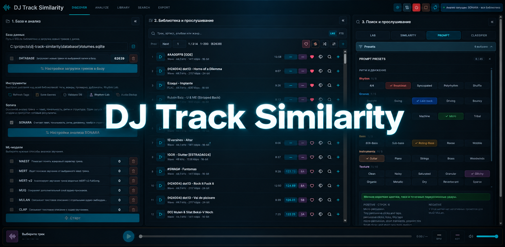
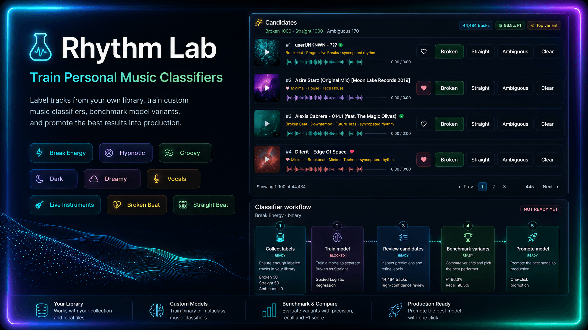

> [!WARNING]
> ## 🚧 Early Development
>
> DJ Track Similarity is a personal AI-powered music analysis project currently under active development.
>
> The goal is to build practical tools for music similarity, custom music classifiers, and DJ-oriented music analysis.
>
> Most components are experimental and the architecture still changes often. Expect incomplete features, breaking changes, and frequent refactoring.

# 🎧 DJ Track Similarity

**Build DJ sets as stories from your own local music library.**

<p align="center">
  
</p>

`dj-track-similarity` is a local-first DJ library workbench for people with large music folders who want more than tag browsing, BPM matching, or a list of similar tracks.

The project is built around a bigger idea:

> I have a large folder of music. I want to analyze it locally, rediscover tracks I already own, search by vibe, sound, references, or text, and build DJ sets that mix cleanly and move like a story.

A good set is not just a sequence of compatible files. It has an opening, tension, release, turns, chapters, and a destination. This project helps turn a reference track into a short list that can shift mood gradually while staying coherent.

## ✨ The core idea

Most DJ tools start with the basic layer:

- BPM
- key
- energy
- metadata
- playlists
- manual crates

That layer matters, but it is not enough when you want a set to feel like a journey.

This project aims to work on three layers at once:

1. **Technical compatibility**  
   BPM, key, duration, energy, and transition-friendly metadata.

2. **Sonic and emotional compatibility**  
   Rhythm, timbre, density, dynamics, texture, atmosphere, mood, and audio similarity.

3. **Set dramaturgy**  
   A higher-level flow where tracks carry one emotional place through chapters toward a coherent destination.

The most important goal is not simply to answer:

> What sounds similar to this track?

The real goal is closer to:

> What track should come next if this set needs to keep flowing while the mood changes slowly?

Similarity is only a building block. The larger ambition is **dramaturgy**.

## 🧭 Library Problem

Large personal libraries hide a lot of forgotten music. You may own the perfect next track, but it is buried somewhere inside thousands of files.

This project should help you:

- discover tracks inside your own collection that you forgot about;
- find music with a very specific sound or atmosphere;
- start from an unusual opener and build outward;
- search by reference tracks, text prompts, or personal taste;
- prepare DJ sets that feel intentional instead of random;
- move between moods gradually instead of jumping abruptly;
- use model output as suggestions, not as truth.

A typical use case:

1. Pick an unusual reference track as the opening of a set.
2. Ask the system for candidates from your local library, or use LAB Reference Compare to inspect how each model ranks the same reference.
3. Review tracks that are close in sound, compatible for mixing, and useful for the next emotional step.
4. Add one candidate.
5. Continue from the previously selected track, letting the set evolve step by step.
6. Shape the flow through listening and manual choices while treating model scores as suggestions.

The set becomes less like a static playlist and more like a musical path.

## 📝 Author note

This is a personal enthusiast project.

I am not an ML researcher, not a music information retrieval expert, and not someone who claims to fully understand every model or music-analysis method used here. I am an enthusiast building a tool I personally wanted: something local, practical, curious, and useful for digging through a large music collection.

That also defines the attitude of the project:

- model outputs are ranking signals, not objective truth;
- the UI should help shortlist tracks, not replace listening;
- every important signal should stay inspectable and separated;
- the final decision belongs to the DJ.

This is not a commercial recommendation service and it is not a benchmark. It is a local workbench for exploration, set preparation, and learning.

<p align="center">
  
</p>

## ✅ What the project can do today

The current application already supports the practical parts of that vision:

- Create one compatible SQLite library and scan local audio files with Mutagen metadata.
- Browse large libraries through paginated API responses.
- Read typed metadata, analysis coverage, likes, audio preview, search state, and the current set.
- Remove a confirmed track from the SQLite catalog and its catalog-owned data while keeping its source audio file.
- Run SONARA, MAEST, MERT, MuQ, MuQ-MuLan, and CLAP analysis jobs.
- Search from seed tracks with MAEST, MERT, MuQ, MuQ-MuLan, CLAP, and SONARA.
- Search from text prompts with CLAP or MuQ-MuLan after audio embeddings for the selected family exist.
- Launch Rhythm Lab for local classifier labeling, training, benchmark review, and promotion.
- Read promoted Rhythm Lab classifier scores for CLASS filtering.
- Run optional Evaluation API and CLI workflows for feedback, profiles, calibration, and transition diagnostics.
- Export the current set as M3U or CSV.
- Run report-first helper tools for Audio Doctor, Audio Dedup, and database optimization.
- Explicitly merge a legacy Core/Artifacts pair into one library database with a backup-first CLI command.

The Python backend and CLI create one selected library database. The optional adjacent
`*.evaluation.sqlite` file is created only when an Evaluation workflow writes data. Normal startup
does not rewrite an incompatible legacy layout. After stopping every database user, migrate a former
Core/Artifacts pair explicitly with `dj-sim migrate-database --db ./data/library.sqlite --confirm 'MIGRATE SINGLE LIBRARY'`; it creates a timestamped backup, verifies the staged one-file database,
and does not start analysis or reanalysis.

The React frontend consumes the current database, track, analysis, search, Current Set, CLASS, LAB,
Rhythm Lab, Audio Dedup, metadata, media, and exact-identity mutation responses. Large-library loading
uses fixed server-side pages of up to `200` tracks with previous, next, and page-number navigation.

## 🚧 The long-term direction

The north star is a DJ assistant that can help generate a playable musical narrative from:

- one or more reference tracks;
- a starting mood and target mood;
- a text prompt or theme;
- a desired emotional arc;
- a personal classifier profile;
- the previous track in the set.

In that direction, a set should be able to feel like chapters in a book:

```text
opening mood -> first turn -> deeper chapter -> tension -> release -> final destination
```

The current project should be understood as a local-first foundation for that idea. Seed search and
CLAP or MuQ-MuLan text search are implemented today. LAB Reference Compare and classifier scoring are also
available. The browser keeps a manual current set and exports playlists. Other parts are still a
product direction rather than a finished automatic DJ.

## 🧩 How the pieces fit

```text
audio files -> scan tags -> SQLite library -> browse/search/export
      |                         ^
      +---- SONARA native -------+
      +---- TorchCodec -> ML -----+
      +---- stored inputs -> classifiers -> CLASS scores
```

The app keeps evidence sources separate:

- **File tags** come from Mutagen during scan and Refresh Tags.
- **SONARA** stores Core audio features such as rhythm, dynamics, timbre, tonal signals, BPM, key, duration, and energy in `sonara_features`, a dedicated 48-dimensional embedding in `sonara_embeddings`, and a versioned acoustic fingerprint in `sonara_fingerprints`. SONARA 0.3.6 Core rows also retain the analysis schema version and BPM analysis range as provenance, which track detail exposes for inspection. Direct Mode reads source paths with native SONARA, while optional Staged Mode copies selected files read-only into a user-selected temporary directory and gives SONARA only the staging paths. A native decode or codec failure for one file recovers through in-process PyAV decoding with the configured shared FFmpeg libraries, then SONARA signal analysis. An unrecovered failure is recorded only for that track.

The BPM range SONARA analyses with belongs to the library rather than to a single run.

- Pick it once in the SONARA analysis settings dialog, from a preset or as your own pair.
- The first SONARA analysis fixes it for the whole library.
- Any later run must reuse that range. To move to another one, reset SONARA analysis first.
- The upper bound must be at least twice the lower one, because SONARA folds estimated tempos by octaves into the range.

| Preset | Range |
| --- | ---: |
| Rekordbox | 70 to 180 |
| VirtualDJ | 80 to 240 |
| Mixed In Key | 79 to 192 |
- **MAEST** stores genre labels and an audio embedding.
- **MERT** stores an audio embedding for seed similarity.
- **MuQ** stores a separate audio embedding. It is available to seed search, LAB Reference Compare, Audio Dedup, and Rhythm Lab classifier feature sets.
- **MuQ-MuLan** stores a separate 512-dimensional L2-normalized audio embedding in `mulan_embeddings`. It supports its own seed-search space and text-to-track retrieval, and compatible Rhythm Lab classifier feature sets can use it. It does not convert or reuse MuQ embeddings.
- **CLAP** stores an audio embedding for text-to-audio search and audio-to-audio comparison.
- **Rhythm Lab classifiers** run as a separate database-only stage and store optional local scores under a classifier key. Each promoted manifest decides which current SONARA and ML inputs are required.

MAEST, MERT, MuQ, MuQ-MuLan, and CLAP reuse one decoded input per track. TorchCodec `0.16` uses
the configured shared FFmpeg libraries in process and returns mono `float32` at the source sample
rate through `AudioDecoder(path, num_channels=1).get_all_samples()`. Its `AudioSamples.data[0]`
stays a 1D CPU `torch.float32` tensor inside `DecodedAudio` and passes directly to each adapter
without a shared Tensor-to-NumPy-to-Tensor round-trip. If that full-track decode fails, the
affected ML family retries with a different decoder: PyAV `17.1.0` reading the same shared FFmpeg
libraries in process, opened tolerantly so a malformed packet is discarded and the valid frames
around it are kept, then downmixed to mono `float32`. A file the primary decoder refuses outright
can still be analyzed from its intact audio. No `ffmpeg.exe` process is started. This is
a recovery path, not a repair of an invalid audio file. Each adapter still applies its own window
preparation and Torchaudio resampling. The selected CPU or CUDA device applies to model inference,
not decoding.

Tempo-aware search and Evaluation transition diagnostics use current signed SONARA tempo
evidence. At low confidence, they also inspect SONARA candidates and the Mutagen BPM tag, while
`grid_stability` can weaken reliability. Unreliable tempo evidence moves toward a neutral score
instead of earning a similarity bonus or becoming an automatic hard rejection.

SONARA mood values are retained for inspection and possible future audio workflows; they are not
current similarity or classifier inputs. In Custom SONARA search, the optional Aggression modifier
uses the stored aggression rank and attenuates its directional bias by SONARA's evidence confidence.
DJ transition mode also adds a soft, directional structural fit when current outro/intro and energy
summary values are available. True peak and ReplayGain remain stored for future loudness-management
work, not direct SONARA similarity scoring. Model embeddings live in dedicated tables in the
library database.

Each successful SONARA analysis writes its Core row, an unnormalized 48-dimensional `float32`
embedding row, and a versioned native-base64 acoustic fingerprint row together under the original
track identity. The fingerprint row in `sonara_fingerprints` contains `track_id`, `track_uuid`,
`fingerprint_version`, `fingerprint_base64`, and `analyzed_at`. Timeline collection remains disabled.
The stored SONARA embedding is not a current similarity, search, classifier, or Audio Dedup input,
and SONARA similarity workflows continue to use Core fields. The stored fingerprint has one current
consumer: the Audio Dedup tool reads it for candidate retrieval and manual-review verification.

Promoted classifier artifacts must describe the feature names and inputs they actually use. If an
analysis update changes that recipe, retrain and promote the affected profile before scoring it
again.

A file genre tag, a MAEST genre label, a CLAP text score, and an audio-to-audio duplicate score answer different questions. They can all help, but they should not be treated as one universal truth scale.

## 🔗 Upstream models and licenses

Optional analysis uses upstream projects and downloaded checkpoints, including [SONARA](https://github.com/kkollsga/sonara), [MAEST](https://github.com/openmirlab/maest-infer), [MERT](https://github.com/yizhilll/MERT), [MuQ and MuQ-MuLan](https://github.com/tencent-ailab/muq), and [LAION CLAP](https://github.com/LAION-AI/CLAP). The repository does not vendor model weights, and upstream code and weights may use different licenses, so check source terms for anything beyond local personal use. See [model citations and licenses](docs/dj-track-similarity/reference/model-citations.md) for details.

## 🎚️ Main workflows

### 1. 🔍 Rediscover your own library

Use the browser, filters, likes, metadata, analysis coverage, CLAP text search, and seed search to find tracks that match a sound you have in mind.

This is useful even when you are not building a set. The project can act like a discovery layer for hidden tracks and unusual textures in your own collection, including songs that match a specific atmosphere.

### 2. 🎯 Start from a reference track

Pick one or more tracks as seeds. The system can rank candidates around the seed using audio-space proximity and SONARA compatibility. LAB keeps model-family results separate for listening-led comparison.

This is useful when you have a track that feels special but you do not know what should come after it.

### 3. 🌊 Curate the current set

Preview search candidates by ear and add useful rows individually to the shared current set. You
can remove entries before export. The same list can be saved as a Rhythm Lab collection; exports
support M3U and CSV. This is browser-local working state, not automatic sequencing.

### 4. 💬 Search by text

After CLAP or MuQ-MuLan audio embeddings exist, choose that family in the PROMPT tab and search your library from prompts such as:

```text
dark hypnotic techno, rolling bass, low light, late night tension
```

The selected text model is loaded into memory by the first search, not when the tab opens; a status line under the search field says which model is loading while that search waits. Later searches reuse the loaded model, and it is released again after about ten minutes without a search. In A/B mode both models load.

CLAP text-search scores are not the same scale as seed-based audio-to-audio scores. Treat them as prompt evidence, not as a universal similarity value. MuQ-MuLan text-search scores stay inside that family's score space and are not directly comparable to CLAP or seed-search scores.

### 5. 🧪 Train personal classifiers

Rhythm Lab is a separate local app for turning your own listening decisions into optional classifier
scores. The backend has routes to launch or reuse it at `127.0.0.1:8777` and to save review
collections. The main frontend exposes both actions, and the standalone Lab UI reports
current/missing/stale source state plus training recipes over every supported feature source.

A new Rhythm Lab labels database starts without a built-in classifier profile. Create or select the profile you want to train. Profile-specific CLI commands use an explicit `--profile`.

The normal loop is:

1. Label examples in Rhythm Lab.
2. Train and review benchmark output for the active profile.
3. Promote one trained artifact into `models/classifiers/<profile>/`.
4. Run classifier scoring in the main library database.
5. Use the promoted scores as CLASS filters.

Classifier scoring is database-only. It reads exactly the SONARA and MAEST/MERT/MuQ/MuQ-MuLan/CLAP inputs named by each promoted manifest, then writes scores for the selected classifier key. It does not decode or retag source audio. Tracks without the complete manifest input set are reported as not ready and are not runtime failures.

SONARA-dependent classifier artifacts must use the same ordered feature recipe as the stored inputs
they score. Missing requested values are skipped rather than imputed as `0.0`. When that recipe
changes, retrain and promote the affected classifier, then rerun its scoring when you choose. Rhythm
Lab labels and feedback remain available for that retraining loop.

Manual commands are available when you want the CLI workflow:

```powershell
python tools/rhythm-lab/rhythm_lab_cli.py serve --source ./data/library.sqlite --labels tools/rhythm-lab/database/rhythm_lab.sqlite
python tools/rhythm-lab/rhythm_lab_cli.py train --profile live_instrumentation --source ./data/library.sqlite --labels tools/rhythm-lab/database/rhythm_lab.sqlite
python tools/rhythm-lab/rhythm_lab_cli.py promote --profile live_instrumentation --source ./data/library.sqlite --labels tools/rhythm-lab/database/rhythm_lab.sqlite
dj-sim analyze-classifier live_instrumentation --db ./data/library.sqlite
```

The default Rhythm Lab state is the single stable database at
`tools/rhythm-lab/database/rhythm_lab.sqlite`. Launching Rhythm Lab from the main app binds that Lab
database to the currently selected library database.

See [Rhythm Lab](docs/dj-track-similarity/tools-and-scripts/rhythm-lab.md), [Train a personal classifier](docs/dj-track-similarity/workflows/train-personal-classifier.md), and [CLASS tab](docs/dj-track-similarity/user-guide/class-tab.md).

## 🚀 Quick start

Verified local development is Windows-first, but the Python package and web app are ordinary local tools. Command examples past the install steps assume the environment is active. Prefix them with `uv run` when it is not.

### What you need

- **`uv`.** This is the only prerequisite on the Python side, because `uv`
  installs the interpreter as well as the packages. You do not need a system
  Python: `.python-version` pins the exact CPython patch release, and `uv`
  downloads that build on the first sync.
- **FFmpeg `8.1.1`, as a full shared build.** The version is checked exactly and
  anything else is refused, including newer releases. `ffmpeg.exe` on its own is
  never enough, because the runtime loads the shared libraries next to it.
- **Node.js**, only when you run the development UI or build the frontend or
  docs from source.
- **A local folder of audio files.** Nothing is copied out of it; see the safety
  model below.

### Step 1 - install the prerequisites

On a clean Windows machine:

```powershell
winget install --id astral-sh.uv --exact
winget install --id OpenJS.NodeJS.LTS --exact
winget install --id Gyan.FFmpeg.Shared --exact --version 8.1.1
```

Pin the FFmpeg version explicitly, as shown. `Gyan.FFmpeg.Shared` tracks the
latest release, so a plain `winget install` hands you a build the runtime will
reject. Extracting an FFmpeg `8.1.1` full shared archive by hand works equally
well; only the version and the shared libraries matter, not how they arrived.

Close and reopen the terminal afterwards so the new `PATH` is visible.

### Step 2 - make FFmpeg discoverable

The runtime needs the directory holding the FFmpeg DLLs - `avcodec-62`,
`avformat-62`, `avutil-60`, `avfilter-11`, `swresample-6`, `swscale-9` - which is
the `bin` directory of a full shared build. It is found in one of two ways:

1. `DJ_TRACK_SIMILARITY_FFMPEG_SHARED_DIR`, when set, is used and nothing else
   is tried. Point it straight at that `bin` directory.
2. Otherwise every directory on `PATH` is examined, and the first one holding a
   matching `8.1.1` build wins.

Setting the variable for your account is the predictable option:

```powershell
[Environment]::SetEnvironmentVariable(
  "DJ_TRACK_SIMILARITY_FFMPEG_SHARED_DIR", "C:\path\to\ffmpeg\bin", "User")
```

Step 4 checks this, so it is fine to move on and come back if the check fails.

### Step 3 - install the project

Three commands, one for each manifest the project keeps. `uv` owns every Python
dependency, including the ones the tools under `tools/` need; `npm` owns the two
Node manifests, which `uv` cannot manage. The documentation install is needed
only if you build or lint the docs site.

```powershell
uv sync --locked --extra dev
npm --prefix .\frontend install
npm --prefix .\docs\dj-track-similarity install
```

`uv sync` reads `.python-version`, downloads that interpreter when the machine
does not already have it, and builds `.venv` in the repository root from
`uv.lock`. `--locked` guarantees the locked dependency set rather than a fresh
resolution. `run_server.cmd` activates that `.venv` itself, so nothing has to be
activated by hand.

To run a command in the environment without activating it, prefix it with
`uv run`, as in `uv run dj-sim scan ...`.

### Step 4 - verify

```powershell
uv run dj-sim doctor
```

This prints the selected Python, the FFmpeg directory and version it resolved,
and the PyAV binding. When FFmpeg is missing or its version is refused, the
error names every directory that was examined and why each one was rejected,
which is usually enough to see what to correct in step 2.

> **`uv sync` is the only supported way to install.**

### First run

Create a database and scan a music folder:

```powershell
mkdir data
dj-sim scan D:/Music --db ./data/library.sqlite
```

Start the development app with the interactive Windows launcher:

```powershell
run_server.cmd
```

It first looks in `database\` under the repository root. If it finds one or more `.sqlite`
databases there, it lists their filenames and asks which one to open, defaulting to
`volumes.sqlite` when present or the first one listed otherwise; you can type a list number, or
type any path to open or create a database elsewhere. If `database\` has no `.sqlite` files yet, it
falls back to suggesting `database\volumes.sqlite`, and Enter creates that path. The next prompt
selects local or LAN mode. The launcher starts the backend plus the Vite live UI. Open the printed
`5173` UI URL; frontend source changes are visible without rebuilding `frontend/dist`.

When you are done with a launcher-managed browser session, click the top-bar power button. The UI
requests `/api/server/shutdown`, the backend tries to stop a managed Rhythm Lab first, the launcher
stops its Vite child after `dj-sim serve` exits, and the browser is asked to close the tab. If the
browser blocks script-driven tab close, the app shows a final fallback page that says the servers
have stopped and the tab can be closed manually.

Supplying `--db` opens an existing compatible library or creates one new library database at that
path. If you omit `--db`, the server starts without a selected database and does not create any
SQLite file. You can then choose an existing database or create a new one with the database picker.

For non-interactive use, specify the mode and database explicitly:

```powershell
run_server.cmd local --db C:/db/volumes.sqlite
run_server.cmd lan --db C:/db/volumes.sqlite
```

`local` binds to `127.0.0.1`. `lan` binds to `0.0.0.0` and prints a LAN URL. Explicit mode commands
use only the arguments supplied on the command line.

## 🧠 Add model-backed analysis

The base install is enough for scan, backend serving, a fresh library database, and set export. Install
optional analysis dependencies when you want the model jobs:

```powershell
uv sync --locked --extra sonara --extra ml --extra rhythm-lab --extra dev
```

`pyproject.toml` declares five extras. `sonara`, `ml` and `rhythm-lab` carry the
analysis stacks, `dev` the test and lint tools, and `audio-online` the two
packages the Audio Online tool needs on top of the base install. Name the ones
you want in a single `uv sync`. Each run installs exactly the set you name.

The `sonara` extra resolves to a patched SONARA `0.3.6` wheel through
`[tool.uv.sources]` rather than to a package index. On another machine, build
that wheel from the SONARA sources and repoint the source entry first.

The `ml` extra is the clearest case for the rule above: it resolves through `[tool.uv.sources]`,
which only `uv` reads. On Windows AMD64 with Python 3.10, `uv` selects `torch`, `torchaudio`, and
`torchvision` from the CUDA 13.0 index plus the exact TorchCodec `0.16.0+cu130` wheel. Other
supported environments select TorchCodec `0.16.0`. The manifests and lockfile describe the tested
environment, not a permanent ban on updates. When dependencies change, update them together and run
focused compatibility checks.

Run a small first pass:

```powershell
dj-sim analyze --models sonara --limit 25 --db ./data/library.sqlite
dj-sim analyze --models maest,mert,muq,mulan,clap --limit 25 --db ./data/library.sqlite
dj-sim analyze-pipeline --stages sonara,ml --db ./data/library.sqlite
```

Normal SONARA reruns select a track when its current Core, dedicated embedding, or fingerprint row
is missing, then store all three outputs together after a successful pass. Tracks with all three
rows remain skipped. Other model jobs target only their missing selected outputs. A legacy split database
is never rewritten at startup. Its one-time, backup-first migration is explicit with
`dj-sim migrate-database`. It does not start analysis. Reanalysis remains a separate user decision.

Useful options from the current CLI and API are:

- `--models sonara` for the standalone CPU/Rust job, or `--models maest,mert,muq,mulan,clap` for ML analysis
- `--sonara-batch-size 1..16`; default `8`, independent from ML batching
- `--device auto|cpu|cuda`
- `--top-k 1..10` for MAEST labels
- `--track-batch-size 1..64`; default `8`
- `--inference-batch-size 1..128`; default `16`
- `--diagnostics` to write decoder and batch timing details to the file log

Every analysis job loads its selected models before it decodes a track, and reports that as a warm-up
phase in the job status and in the browser process box. Weights download on first use rather than at
install time, so the first job for a family waits here instead of mid-run. Loaded models are reused
for the life of the server process. See
[Model warm-up](docs/dj-track-similarity/reference/analysis-families.md#model-warm-up).

CLI and API pipeline stages share one in-memory queue, so only one SONARA or ML stage
runs at a time. The pipeline fixes the order to SONARA, then ML. Per-file failures are retained in job status and do
not stop the next stage. A fatal initialization error or cancellation does.

Browser SONARA analysis starts in Direct Mode with BatchSize `8`; it reads the selected source files
without making staging copies. Staged Mode is available for libraries on slower disks. Its folder
starts empty and must be selected before analysis. Its editable defaults are Processes `4`, Threads
`4`, BatchSize `4`, and StageSize `32`. Those numbers are kept in browser `localStorage`. The
staging folder is not, because it receives temporary copies of your audio, so every session asks
for it again. ML Staged Mode keeps its own folder the same way.

In Staged Mode, StageSize bounds the copy, ready, and analysis window. Completed copies join one
shared ready queue, where each process takes up to BatchSize files without cross-process batch
barriers and sets its Rayon pool from Threads. Core and embedding writes remain per-track savepoints
under the original source-track identity. The process log reports copy, native analysis, result
preparation, and database storage times plus shared-library recovery and per-track errors. Staging copies are
deleted after each track completes, and the temporary job directory is cleaned up after completion,
failure, or cancellation. Each Staged run uses a new unique job directory. Before it starts, the
runner removes owner-marked job directories whose recorded process is no longer running and empty
`sonara-stage-*` residues without a valid owner marker. It preserves a directory with a live owner
and a nonempty directory without a valid marker. ML has a separate optional Staged Mode with its
own temporary folder and copy/decode workers. It copies selected ML candidates read-only, then runs
copy, decode, and inference. ML StageSize bounds the active staging window rather than the whole
job. Each completed track has its staging copy deleted, and the window refills until every candidate
in the current ML job has finished. Without ML Staged Mode, ML analysis reads original source paths
and uses its separate full-TorchCodec decode. It then falls back to the tolerant PyAV
shared-library decode if that decode fails. The recovery does not start `ffmpeg.exe`.
Queued-stage messages contain only settings used by that stage. SONARA reports its mode and the
relevant Direct or Staged values, ML reports its models, device, Track batch, and Inference batch.
Classifier scoring runs as its own job rather than as a pipeline stage.

MuQ uses the optional `ml` dependencies and official `OpenMuQ/MuQ-large-msd-iter` weights. MuQ-MuLan uses the same optional dependencies and official `OpenMuQ/MuQ-MuLan-large` weights. Both receive mono 24 kHz `float32` audio in 10-second windows and support CPU or CUDA. MuQ-MuLan writes its own normalized 512D vectors. It does not derive them from MuQ. The two families remain separate score spaces. CUDA is recommended for full-library runs.

In the CLI, omit `--limit` to analyze the whole library.

## 🖥️ Frontend status

The React source uses the current backend responses. Its main search tabs are LAB, SONARA,
SIMILARITY, PROMPT, and CLASS. The SIMILARITY model selector searches separate MAEST, MERT, MuQ,
and MuQ-MuLan embedding spaces. Search results provide individual current-set actions, and the shared
Current Set panel provides preview, removal, Rhythm Lab collection transfer, M3U export, and CSV export.
Database changes clear catalog-bound state. Exact-identity writes carry the catalog UUID and the
track UUID, and the API refuses either value with surrounding whitespace (HTTP 422) instead of
searching for a track that cannot exist.

The interface is in Russian. Model names, tab labels, and mode names stay English. See
[UI language](docs/dj-track-similarity/help/ui-language.md) for the label glossary the rest of the
documentation refers to.

The UI remains a local, listening-led workbench. Similarity and classifier values are ranking
signals for review, not objective musical truth or automatic performance decisions.

## 🛠️ Maintenance tools

- **Audio Doctor** checks audio metadata/container issues. It is dry-run-first. Apply mode writes as soon as you pass `--apply`, backs up each file first, verifies the result, and restores the backup on failure. See [Audio Doctor](docs/dj-track-similarity/tools-and-scripts/audio-doctor.md).
- **Audio Dedup** reports duplicate candidates from saved SONARA fingerprints and stored MERT, MAEST, MuQ, and CLAP analysis data. Its default `--fingerprint` mode decides duplicates from exact fingerprint matches alone and keeps every candidate manual-review. The secondary `--embedding` mode scores the enabled sources with configurable weights and is the only mode that can mark safe delete candidates; MuQ alone never authorizes deletion. A read-only FFmpeg spectral check flags suspected transcodes inside duplicate groups and steers keeper choice toward full-band copies. A CLI apply run requires you to type `APPLY DELETE`. The browser sends that phrase itself once you confirm the deletion dialog. A CLI `--apply` run deletes only safe candidates inside the selected root, while the browser review dialog opens any report, plays the copies, and deletes the ones you mark to the recycle bin or permanently. See [Audio Dedup](docs/dj-track-similarity/tools-and-scripts/audio-dedup.md).
- **Database optimization** supports the main library database and the Rhythm Lab labels database. It backs up the SQLite file, checks integrity, and then runs SQLite maintenance commands. See [Optimize database](docs/dj-track-similarity/tools-and-scripts/optimize-database.md).

Common maintenance commands:

```powershell
python tools/audio-doctor/audio_doctor_cli.py --db ./data/library.sqlite
python tools/audio-dedup/audio_dedup_cli.py --db ./data/library.sqlite --root D:/Music --preset safe
python scripts/optimize_database.py --db ./data/library.sqlite
python scripts/optimize_database.py --db tools/rhythm-lab/database/rhythm_lab.sqlite
```

## 🛡️ Safety model

Default workflows do not modify source audio files:

- scan
- Refresh Tags
- analysis
- search
- audio preview
- analysis reset
- database clear
- confirmed single-track catalog removal
- relocation preview
- set generation
- export
- classifier scoring

Explicit write paths are narrow:

- MAEST genre tag apply writes the standard genre field in audio files.
- Audio Doctor apply can repair previously reported repairable files.
- Audio Dedup deletion can delete confirmed duplicate copies from the CLI or the browser review dialog.
- Library relocation apply updates stored SQLite paths only. It does not move, copy, delete, or retag audio files.

SQLite databases, logs, reports, generated indexes, and promoted classifier artifacts can reveal library information. Keep them out of Git unless you intentionally choose otherwise.

## 📚 Documentation

Start here:

- [Project guide](docs/dj-track-similarity/project-guide.md)
- [Project idea](docs/dj-track-similarity/concepts/project-idea.md)
- [Quickstart](docs/dj-track-similarity/getting-started/quickstart.md)
- [Install](docs/dj-track-similarity/getting-started/install.md)
- [First library](docs/dj-track-similarity/getting-started/first-library.md)
- [First analysis](docs/dj-track-similarity/getting-started/first-analysis.md)
- [Migrate and reanalyze SONARA storage](docs/dj-track-similarity/workflows/reanalyze-sonara-split-storage.md)
- [Browse library](docs/dj-track-similarity/user-guide/browse-library.md)
- [Search with seeds](docs/dj-track-similarity/user-guide/search-with-seeds.md)
- [Text search](docs/dj-track-similarity/user-guide/text-search.md)
- [Local-first safety](docs/dj-track-similarity/concepts/local-first-safety.md)
- [SONARA integration](docs/dj-track-similarity/reference/sonara-integration.md)
- [Tools and scripts](docs/dj-track-similarity/tools-and-scripts/index.md)
- [CLI reference](docs/dj-track-similarity/reference/commands.md)
- [Audio Online](docs/dj-track-similarity/tools-and-scripts/audio-online.md)
- [Scripts](docs/dj-track-similarity/tools-and-scripts/scripts.md)
- [UI language](docs/dj-track-similarity/help/ui-language.md)
- [Model citations and licenses](docs/dj-track-similarity/reference/model-citations.md)

## 🧪 Development checks

Development happens on `main`: branch from `origin/main` and push there. The `dev`
branch is a frozen snapshot from 2026-09-04 and takes no new commits.

Use the smallest check that covers the changed behavior. The root Pytest
configuration collects only `tests/`; Rhythm Lab and script tests must be named
explicitly.

```powershell
python -m pytest tests/test_sonara_features.py
python -m pytest tools/rhythm-lab/tests/test_rhythm_lab.py
```

For frontend changes, run type checking and the focused Node tests. The static
bundle build is required before a commit.

```powershell
npm --prefix .\frontend run typecheck
npm --prefix .\frontend test
npm --prefix .\frontend run build
```

For maintained documentation changes, run:

```powershell
npm --prefix .\docs\dj-track-similarity run check
```

Run `npm run vale:sync` once after a fresh checkout or when `.vale.ini` packages change.
After a behavior change, also exercise the matching browser, HTTP API, CLI, or
library surface with a happy path and a relevant failure path. See
[Testing and verification](docs/dj-track-similarity/developer/testing-and-verification.md)
for the full routing matrix.
