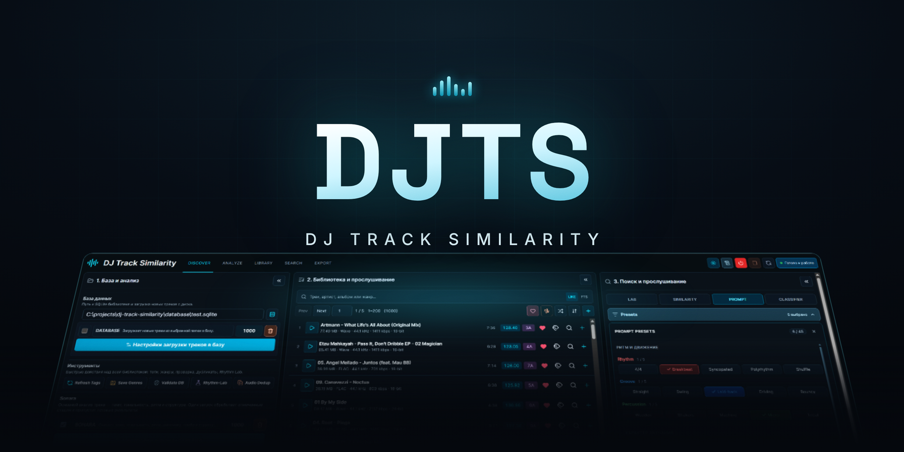
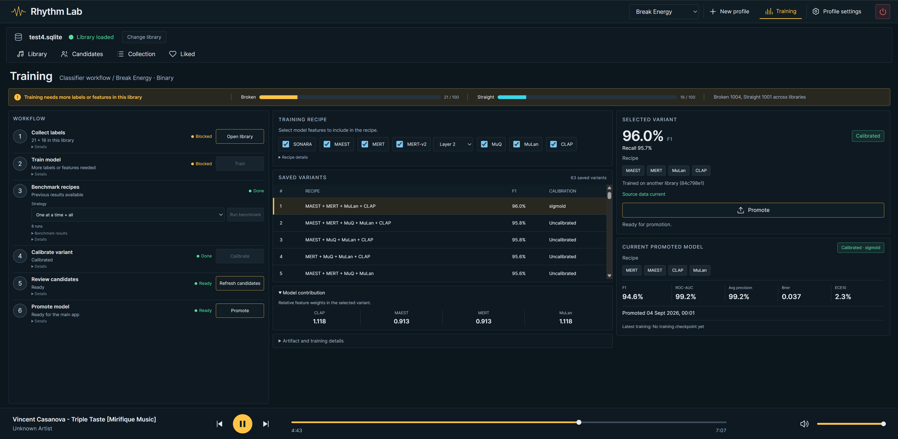
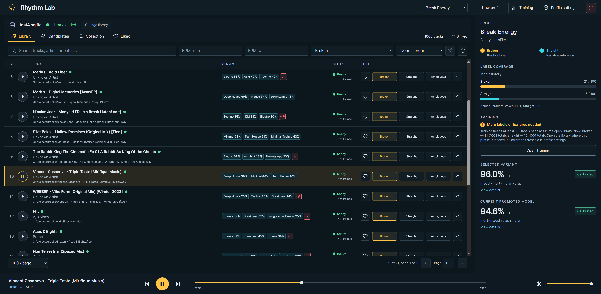
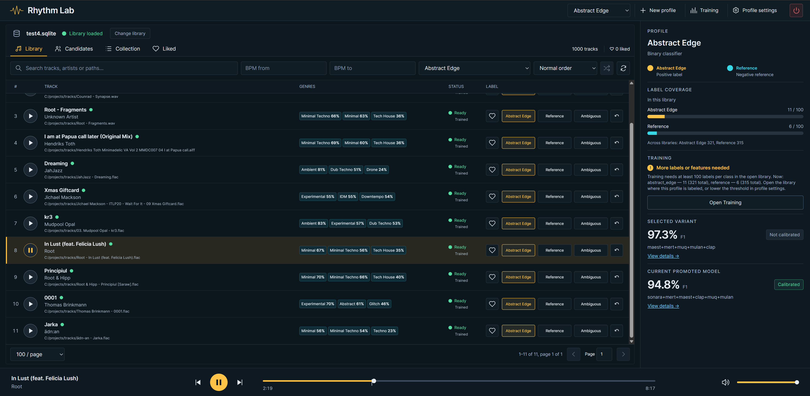

> [!WARNING]
> **⚠️ Early development.** This is a personal enthusiast project under active development. Schemas, commands, defaults, and UI structure change often. Expect incomplete features and breaking changes.

# 🎧 DJ Track Similarity

**Build DJ sets as stories from your own local music library.**

<p align="center"></p>

`dj-track-similarity` is a local-first workbench for large music folders. It scans them into a SQLite library and runs audio-model analysis on your own machine. Search ranks candidates around seed tracks or text prompts, and the set you assemble by ear exports as M3U or CSV. The server binds to `127.0.0.1` by default, and model assets load only from the local `models/` directory with downloads disabled. Model scores are ranking evidence for listening, not DJ decisions.

---

## ✨ The core idea

BPM, key, energy, tags, and crates are the usual DJ toolkit. This project keeps that layer and adds two more:

1. **Technical compatibility.** BPM, key, duration, energy, and related metadata from SONARA analysis and file tags. Available today.
2. **Sonic compatibility.** Rhythm, timbre, density, dynamics, and audio similarity from SONARA features and MAEST, MERT, MERT-v2, MuQ, MuQ-MuLan, and CLAP embeddings, plus texture and atmosphere through text prompts. Available today as ranking evidence.
3. **Set dramaturgy.** A set that keeps flowing while the mood changes slowly, through chapters toward a destination. This is the direction. Nothing in the app orders a set automatically, and stored mood values are not a similarity input yet.

The goal is a DJ assistant that builds a playable narrative from reference tracks, start and target moods, a text prompt, an emotional arc, a personal classifier profile, and the previous track in the set. Similarity is one building block of that goal.

Large personal libraries hide music you forgot you own. A typical loop with the current app:

1. Seed a search with an unusual opener, or open the LAB tab to compare how each model ranks the same reference.
2. Preview the candidates, add one to the current set, and seed the next search from it.
3. Repeat, shaping the flow by listening rather than by score.

The author claims no ML or music-information-retrieval expertise. Model outputs are stored separately per model so you can inspect them. The full background and the feature/direction boundary live in the [project idea](docs/dj-track-similarity/concepts/project-idea.md) page.

---

## ✅ What the project can do today

- **📂 Browse your library.** Scan a local music folder into one SQLite library (tags read with Mutagen) and browse it in server-side pages.
- **🎧 Find similar tracks.** Analyze tracks with SONARA, MAEST, MERT, MERT-v2, MuQ, MuQ-MuLan, and CLAP, and search from seed tracks with any of those seven models.
- **💬 Search by text.** Search from text prompts with CLAP or MuQ-MuLan once that family's audio embeddings exist (see workflow 4 for A/B comparison and feedback).
- **🧪 Train personal classifiers.** Use Rhythm Lab to label, train, benchmark, and promote classifiers, then filter the library by their scores in the CLASSIFIER tab.
- **🎚️ Build a set.** Keep a manual current set, export it as M3U or CSV, and remove a confirmed track from the catalog without touching its audio file.
- **🛠️ Maintain the library.** Review duplicate candidates with Audio Dedup and check or compact the selected database (see [Maintenance tools](#-maintenance-tools)).

---

## 🚀 Installation

> [!IMPORTANT]
> **🪟 Windows x64 and 64-bit PowerShell 7 are required for the supplied installer.** The dependency sources and launchers are configured for this platform. Linux and macOS need adaptation. Codex or Claude Code can help review the project and select compatible packages and launch methods for your system.

> **💾 Storage and downloads.** Have an internet connection and enough free space for **about 11.2 GB of model assets**, plus the Python environment, tools, download caches, and your library database.

> [!WARNING]
> **🎮 GPU analysis needs a compatible NVIDIA GPU and driver.** The selected PyTorch binaries include the **CUDA 13.0 runtime**, so you do not need to install a separate CUDA Toolkit or cuDNN. The installer checks CUDA availability but does not install a graphics driver. See the [NVIDIA CUDA guide for Windows](https://docs.nvidia.com/cuda/archive/13.0.0/cuda-installation-guide-microsoft-windows/index.html), [driver compatibility](https://docs.nvidia.com/deploy/cuda-compatibility/minor-version-compatibility.html), and [PyTorch binary guidance](https://discuss.pytorch.org/t/should-i-install-the-extra-cudatoolkit-and-cudnn/194528). CPU inference is available. CUDA is recommended for full-library ML analysis.

### 📦 What the installer prepares

[install.ps1](install.ps1) installs the application and analysis stack together. Compatible tools are reused. The tool versions below are the installer's downloads when a suitable installation is unavailable. Python packages follow [pyproject.toml](pyproject.toml) and [uv.lock](uv.lock). Frontend packages follow [frontend/package-lock.json](frontend/package-lock.json).

| Component | Version or source | Purpose |
| --- | --- | --- |
| Project | [DJ Track Similarity, dev branch](https://github.com/MeteorBurn/dj-track-similarity/tree/dev) | Download first. Includes the application, installer, and launchers |
| [Python](https://www.python.org/) and [uv](https://docs.astral.sh/uv/) | CPython **3.10.20** / uv **0.11.12** | Shared Python environment and dependency installation |
| [Node.js](https://nodejs.org/en) and npm | Node.js **24.15.0**, with its bundled npm | Frontend installation and build |
| Frontend | React **19.2.5**, Vite **7.3.6**, TypeScript **5.9.3** | Browser interface |
| PyTorch / TorchAudio / TorchVision | **2.11.0+cu130 / 2.11.0+cu130 / 0.26.0+cu130** ([version matrix](https://pytorch.org/get-started/previous-versions/#v2-11-0)) | ML inference with CUDA 13.0 binaries |
| [TorchCodec](https://github.com/meta-pytorch/torchcodec) | **0.16.0+cu130** | Audio decoding for ML |
| [FFmpeg](https://ffmpeg.org/) and [PyAV](https://pyav.org/) | FFmpeg **8.1.1 full shared** / PyAV **17.1.0** | Shared audio libraries and decode recovery |
| Microsoft Visual C++ runtime | [x64 Redistributable](https://learn.microsoft.com/en-us/cpp/windows/latest-supported-vc-redist), installer package **14.51.36247.0** | Native runtime DLLs, installed if missing |
| Model packages | Transformers **5.13.0**, Hugging Face Hub **1.22.0**, MAEST Infer **0.2.0**, MuQ **0.1.0**, LAION CLAP **1.1.7** | Model loading and inference |
| Scientific packages | NumPy **1.26.4**, SciPy **1.15.3**, scikit-learn **1.7.2**, joblib **1.5.3** | Features, classifiers, and numerical processing |
| Web and metadata packages | FastAPI **0.139.0**, Uvicorn **0.51.0**, Pydantic **2.13.4**, Mutagen **1.48.1** | Local server, validation, and audio tags |

> [!NOTE]
> **🔧 Runtime setup:** FFmpeg includes the shared DLLs. An executable alone is insufficient. Downloaded portable tools stay inside the project, and the installer does not change your user or system `PATH`.
>
> **🪟 Windows runtime.** Installing the Microsoft runtime may request administrator approval or report that Windows needs a restart. The installer never restarts the computer itself.

### 🎛️ Audio Features Extraction Engine

SONARA engine extracts audio features such as BPM, key, energy, rhythm, timbre, together with an acoustic fingerprint. CPU analysis provides the track data required before ML processing.

The installer includes **SONARA 0.3.6** with decoder patches (RIFF-chunk padding) from the [MeteorBurn/sonara fork](https://github.com/MeteorBurn/sonara/releases/tag/v0.3.6-meteorburn.1). It is installed as a Python package and needs no separate model checkpoint download.

> **📚 Citation:** original [SONARA project by kkollsga](https://github.com/kkollsga/sonara).

### 🧠 Installed models

The installer downloads the ML assets below into `models/` and verifies their SHA-256 hashes. Valid existing files are kept, and interrupted downloads can resume when the server supports it. Analysis reads the local files without automatic model downloads.

| Model | Local assets | Approximate size |
| --- | --- | ---: |
| 🧠 [MAEST](https://github.com/palonso/MAEST) | Checkpoint | 0.34 GB |
| 🧠 [MERT-v1-95M](https://huggingface.co/m-a-p/MERT-v1-95M) | Weights and configuration | 0.38 GB |
| 🧠 [MERT-v2-FullSong](https://huggingface.co/m-a-p/MERT-v2-FullSong) | Weights and configuration | 2.53 GB |
| 🧠 [MuQ-large-msd-iter](https://huggingface.co/OpenMuQ/MuQ-large-msd-iter) | Weights and configuration | 1.33 GB |
| 🧠 [MuQ-MuLan-large](https://huggingface.co/OpenMuQ/MuQ-MuLan-large) | Audio/text assets, including XLM-RoBERTa | 3.78 GB |
| 🧠 [CLAP music_audioset](https://huggingface.co/lukewys/laion_clap) | Audio/text assets, including RoBERTa | 2.85 GB |
| **💾 Total** | **Downloaded ML assets** | **11.22 GB** |

> **💾 Size notes.** Sizes use decimal GB and are rounded independently. MuQ-MuLan also uses the MuQ files listed above, counted once in the total.

### 💾 Install the project

1. Open the [dev branch on GitHub](https://github.com/MeteorBurn/dj-track-similarity/tree/dev), choose **Code → Download ZIP**, and extract it into a folder where you can keep the application and its models.
2. Close any running application or server windows. Open the project folder in **PowerShell 7** and run **install.ps1**. Installation covers the Python environment and browser interface plus model downloads. It also checks the audio and ML runtime.
3. Wait for the installer to finish, then use the launchers below. **run_server.cmd** and **run_rhythm-lab.cmd** are included in the repository.

> [!TIP]
> **🤖 Installation help:** If installation fails, keep the installer output and ask **Codex or Claude Code** to inspect it together with [AGENTS.md](AGENTS.md), [install.ps1](install.ps1), and the dependency files. Include your Windows version, GPU, and driver version so the agent can distinguish a download failure from a runtime or hardware problem.

---

## ▶️ Start the application

### 🖥️ Main application

Open **[run_server.cmd](run_server.cmd)**. Its console guides you through database selection and network access:

**🆕 First library**

When `database/` contains no `.sqlite` libraries, the console shows:

```text
Database path [<project>\database\volumes.sqlite]:
```

Press **Enter** for the default, or type a path such as `database/my-library.sqlite`. A new file is created when the server starts. Here, `<project>` is your extracted project folder.

**📂 Existing libraries**

When libraries are available, the console lists them by number:

```text
Database [1-N, default K, or a path]:
```

Enter a number, press **Enter** for the indicated default, or type a path to select or create another library. `N` and `K` are the numbers printed by the launcher.

**🌐 Local or network access**

```text
Choose server mode:
1. Local only http://127.0.0.1:5173/
2. Local network http://<this-computer-lan-ip>:5173/
Mode [1/2, default 1]:
```

Press **Enter** or **1** for Local only at [http://127.0.0.1:5173/](http://127.0.0.1:5173/). Choose **2** for Local network so other devices on that network can connect. The launcher prints your computer's LAN address. Choose this mode only when you want network access.

Keep the console window open and follow the **Open UI** address it prints. In the browser, scan your music folder into the selected library. Source files stay in place. **Ctrl+C** or the top-bar power button stops the servers.

### 🧪 Rhythm Lab

Prefer the **Rhythm Lab** button in the main interface. It opens the lab for the selected library at [http://127.0.0.1:8777/](http://127.0.0.1:8777/), managed in the main server's console window.

For an independent session without the main application, open **[run_rhythm-lab.cmd](run_rhythm-lab.cmd)** and select an existing library. This launcher does not create a new source library. If the main application is already running, the launcher hands the request to it. Close an independent lab session before starting the main application, then reopen the lab with its button.

---

## 🧠 First analysis

Start with **SONARA** analysis in the browser after scanning. SONARA is a CPU stage. The separate **ML** stage accepts only tracks with current SONARA analysis. Reruns fill missing outputs. Check the job status for individual file failures.

Choose the SONARA BPM range in its settings before the first run. That range belongs to the library, and changing it later requires a SONARA analysis reset. For ML, select the models and CPU or CUDA device in the analysis settings.

Each job warms up its selected models before decoding tracks. **Direct Mode** reads the original files in place. **Staged Mode** can help with slow disks by analyzing temporary copies in a folder you choose. The original audio is unchanged. The staging folder must be selected again in each browser session.

---

## 🎚️ Main workflows

The browser interface is in Russian. Model names, tab labels, and analysis mode names stay English, and [UI language](docs/dj-track-similarity/help/ui-language.md) maps the labels. Search tabs are SIMILARITY, PROMPT, CLASSIFIER, and LAB (Model Listening Lab).

### 1. 🔍 Rediscover your own library

Filters, likes, analysis coverage, text search, and seed search find tracks that match a sound you have in mind, with or without a set in progress. See [Browse library](docs/dj-track-similarity/user-guide/browse-library.md).

### 2. 🎯 Start from a reference track

Pick up to five tracks as seeds. The SIMILARITY tab ranks candidates in one model space per search: SONARA measured Core features with a manual mixer of five sliders and nine directional modifiers, or a MAEST, MERT, MERT-v2, MuQ, MuQ-MuLan, or CLAP embedding space, where MERT-v2 searches one selectable stored layer of its 24. The LAB tab takes the first seed and shows a short candidate list per available model. Scores are model-specific, and a saved listening verdict reappears when the same candidate returns for that reference and model. See [Search with seeds](docs/dj-track-similarity/user-guide/search-with-seeds.md).

### 3. 🌊 Curate the current set

Preview candidates and add rows to the shared current set. Any result list adds one row at a time. Bulk adds exist for the whole current library page in the browser and for every shown PROMPT candidate. The set panel in the EXPORT workspace previews and removes tracks. It also saves the list as a Rhythm Lab collection and exports M3U or CSV. The set is in-memory browser state rather than automatic sequencing, and switching databases clears it together with other catalog-bound state. See [Export playlists](docs/dj-track-similarity/user-guide/export-playlists.md).

### 4. 💬 Search by text

After CLAP or MuQ-MuLan audio embeddings exist, the PROMPT tab searches your library from a prompt bank composed of presets. Each preset carries its own wording per model plus optional negative prompts you can switch off.

A/B runs MuQ-MuLan and CLAP side by side. Approve or reject results to save feedback for that exact query and model. Later PROMPT-tab searches of the same query apply it automatically once at least three usable approvals exist. The results show the executed query and whether feedback applied.

The first search loads the text model, which stays cached until about ten minutes pass without a search. Text-search scores are prompt evidence inside one model's score space and are not comparable to seed-search scores or to the other text model. See [Text search](docs/dj-track-similarity/user-guide/text-search.md).

### 5. 🧪 Train personal classifiers

**🧪 Training (Break Energy profile)**

<p align="center"></p>

**⚡ Library (Break Energy profile)**

<p align="center"></p>

**🎨 Library (Abstract Edge profile)**

<p align="center"></p>

Rhythm Lab is a separate local app that turns listening decisions into classifier scores. Launch it from the main app. The backend starts it at [http://127.0.0.1:8777/](http://127.0.0.1:8777/) on the selected library, with labels in `tools/rhythm-lab/database/rhythm_lab.sqlite`. Rhythm Lab can switch libraries while running. The main app's Rhythm Lab button asks an existing managed instance to switch to the selected library. Switching is unavailable during a profile operation. A new labels database has no built-in profile, so create or select the one you want to train. See [Rhythm Lab](docs/dj-track-similarity/tools-and-scripts/rhythm-lab.md), [Train a personal classifier](docs/dj-track-similarity/workflows/train-personal-classifier.md), and [CLASSIFIER tab](docs/dj-track-similarity/user-guide/class-tab.md). The loop:

1. Label examples in Rhythm Lab.
2. Train and review the profile.
3. Promote the trained classifier for use in the main app.
4. Score the library with the promoted classifier from the CLASSIFIER tab.
5. Filter by the scores in the CLASSIFIER tab.

Labels follow the audio through its SONARA fingerprint, including across libraries that contain the same content. Analyze tracks with SONARA before labeling them. A profile chooses which stored model outputs to use. Training, benchmarking, and calibration become available when every class meets that profile's minimum label count in the open library.

Scoring reads stored analysis and writes classifier results to the database. It skips tracks missing an input required by the promoted classifier and does not change the audio files.

---

## 🧩 How the pieces fit

```text
audio files -> scan tags -> SQLite library -> browse/search/export
      +---- native SONARA -----------^
      +---- TorchCodec (PyAV recovery) -> ML families ---^
      +---- stored inputs -> classifiers -> CLASSIFIER scores
```

The app keeps evidence sources separate and never folds them into one score scale. A file genre tag, a MAEST genre label, a CLAP text score, and a duplicate score answer different questions ([Similarity scores](docs/dj-track-similarity/concepts/similarity-scores.md)).

- **File tags** come from Mutagen during scan and Refresh Tags.
- **SONARA** stores measured Core features (BPM, key, duration, energy, rhythm, dynamics, timbre, tonal signals), a timeline (beats, downbeats, chord events, segments, and energy, loudness, and tempo curves), a 48-dimensional embedding, and a versioned acoustic fingerprint. A SONARA write needs all four outputs and stores them together. Startup reports an error if an older library lacks the `sonara_timeline` table. It never adds the table automatically. The first SONARA run claims the library's BPM analysis range. Later runs reuse that range. A different range requires a SONARA analysis reset. The library rejects an upper bound below twice the lower one. Presets are Rekordbox 70 to 180, VirtualDJ 80 to 240, and Mixed In Key 79 to 192.
- **MAEST** stores genre labels and an audio embedding.
- **MERT**, **MERT-v2**, **MuQ**, **MuQ-MuLan**, and **CLAP** each store their own audio embedding in a separate seed-search space. MERT-v2 stores all 24 transformer layers instead of one vector. CLAP and MuQ-MuLan also serve text-to-track search. MuQ-MuLan does not reuse MuQ embeddings.
- **Rhythm Lab classifiers** score from stored inputs only and save results under a classifier key (see workflow 5).

The ML families share one in-process decode per track: TorchCodec `0.16` over the shared FFmpeg `8.1.1` libraries, with a per-family PyAV `17.1.0` retry that discards malformed packets and keeps the valid audio around them. SONARA decodes natively and uses the same PyAV retry. The retry recovers a readable file. It does not repair a damaged one. Decoding never launches `ffmpeg.exe`, and the runtime check reads the release version from `libavutil` without starting a process. Only the Audio Dedup spectral check runs `ffmpeg` from `PATH`. The CPU or CUDA device applies to inference only. See [Analysis families](docs/dj-track-similarity/reference/analysis-families.md).

Tempo comparisons weight SONARA BPM by its confidence and beat-grid stability. Unreliable tempo drifts toward a neutral score instead of earning a bonus or a hard rejection. Transition diagnostics also consult SONARA tempo candidates and the file BPM tag at low confidence, while SONARA similarity search uses stored SONARA values only.

The SONARA fingerprint feeds Audio Dedup and the Rhythm Lab `content_key`. No search, classifier, dedup, or Rhythm Lab workflow reads the SONARA embedding or timeline yet. Mood, true peak, and ReplayGain are stored for inspection and Rhythm Lab feature sets, not for similarity scoring. In SIMILARITY search with the SONARA model, the Aggression modifier uses the stored aggression score and shrinks its directional push by SONARA's aggression confidence. See [Features, embeddings, and tags](docs/dj-track-similarity/concepts/features-embeddings-tags.md).

---

## 🔗 Upstream models and licenses

Optional analysis uses upstream projects and downloaded checkpoints: [SONARA](https://github.com/kkollsga/sonara), [MAEST](https://github.com/openmirlab/maest-infer), [MERT](https://github.com/yizhilll/MERT), [MuQ and MuQ-MuLan](https://github.com/tencent-ailab/muq), and [LAION CLAP](https://github.com/LAION-AI/CLAP). The repository does not vendor model weights. Upstream code and weights carry different licenses, so check their terms for anything beyond local personal use. See [model citations and licenses](docs/dj-track-similarity/reference/model-citations.md).

---

## 🛠️ Maintenance tools

- **🔍 Audio Dedup** finds duplicate candidates from stored fingerprints and embeddings. Review the report in the browser and choose which copies to remove. Deletion requires confirmation, uses the recycle bin by default, rechecks file identity, and keeps at least one copy on disk per group. See [Audio Dedup](docs/dj-track-similarity/tools-and-scripts/audio-dedup.md).
- **✅ Database validation** checks SQLite integrity, track identities, and stored analysis without changing the library.
- **🗃️ Database optimization** is available after validation reports zero errors. A verified backup protects the database during compaction and index maintenance. Verification then checks the result. The temporary backup is removed after success and kept if verification fails. See [Optimize database](docs/dj-track-similarity/tools-and-scripts/optimize-database.md).

Older database formats need an explicit migration. Starting the app never converts them automatically.

---

## 🛡 Safety model

Normal workflows read source audio and never modify it. Scan, Refresh Tags, analysis, search, browser preview, analysis reset, database clear, confirmed single-track catalog removal, relocation preview, export, and classifier scoring write only SQLite rows, logs, reports, Rhythm Lab's temporary preview WAV files (the main app streams its preview without a file), temporary Staged Mode copies in the staging folder you choose, or exported M3U and CSV files.

Only three workflows touch source audio, and each one is explicit:

- **🏷️ MAEST genre tag apply** writes the standard genre field of tracks with stored MAEST genres.
- **🩺 Audio Doctor repair** rewrites repairable files in place. It backs up and verifies each file by default.
- **🗑️ Audio Dedup deletion** removes confirmed duplicate copies after an explicit confirmation.

Library relocation updates stored database paths only. It never moves, copies, deletes, or retags files.

SQLite databases, logs, reports, and promoted classifier artifacts reveal library paths and listening decisions, so `.gitignore` excludes them. [Local-first safety](docs/dj-track-similarity/concepts/local-first-safety.md) holds the full write-path table.

---

## 📚 Documentation

The docs site starts at the [project guide](docs/dj-track-similarity/project-guide.md). It is temporarily unmaintained and may describe older behavior. Use this README for current installation guidance.

| Topic | Pages |
| --- | --- |
| 🚀 Getting started | [Quickstart](docs/dj-track-similarity/getting-started/quickstart.md), [Install](docs/dj-track-similarity/getting-started/install.md), [First library](docs/dj-track-similarity/getting-started/first-library.md), [First analysis](docs/dj-track-similarity/getting-started/first-analysis.md) |
| 🎚️ Everyday use | [Browse library](docs/dj-track-similarity/user-guide/browse-library.md), [Analyze library](docs/dj-track-similarity/user-guide/analyze-library.md), [Search with seeds](docs/dj-track-similarity/user-guide/search-with-seeds.md), [Text search](docs/dj-track-similarity/user-guide/text-search.md), [Export playlists](docs/dj-track-similarity/user-guide/export-playlists.md) |
| 🛠️ Reference and maintenance | [Configuration](docs/dj-track-similarity/reference/configuration.md), [Database](docs/dj-track-similarity/reference/database.md), [SONARA integration](docs/dj-track-similarity/reference/sonara-integration.md), [Tools and scripts](docs/dj-track-similarity/tools-and-scripts/index.md) |

---

## 🤖 Optional coding-agent setup

The application does not require an agent plugin. For Codex or Claude Code, the shared agents and skills live in [.djts/](.djts/). [AGENTS.md](AGENTS.md) routes project instructions and verification, and [Agent setup](docs/agent-guides/agent-layer.md#agent-layer) explains the optional integration.
