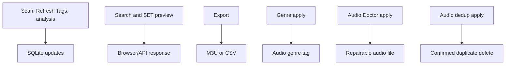

# Local-first safety model

> Audience: Users and developers checking write boundaries.
> Goal: Explain what writes SQLite, reports, audio tags, or deletes files.
> Type: explanation

## Model

Normal app workflows read audio and write SQLite state. Only named exceptions touch source audio or delete files.

## Map

## Relocation

Relocation apply updates stored `tracks.path` values only after missing-file and conflict checks pass.
