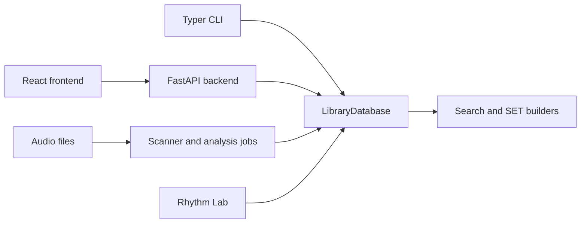

# Architecture map

> Audience: Developers orienting in the repository.
> Goal: See main components and data flow without reading every module first.
> Type: explanation

## Map

## Code map

- `database.py` and `db_schema.py`: SQLite schema, writes, caches, resets, clear.
- `scanner.py`: supported audio discovery and Mutagen metadata reads.
- `analysis_jobs.py`, `sonara_jobs.py`, `genre_jobs.py`: cancellable jobs.
- `search.py`, `sonara_similarity.py`, `set_builder.py`: search and SET logic.
- `api_routes_*.py`: FastAPI route groups.
- `frontend/src/`: API mirror and UI panels.
