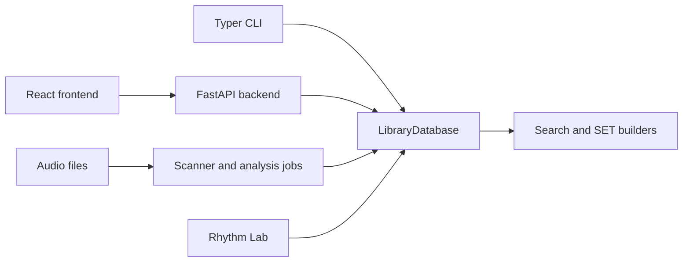

# Architecture map

> Audience: Developers orienting in the repository.
> Goal: See main components and data flow without reading every module first.
> Type: explanation

## Map

## Code map

- `database.py`, `db_schema.py`, `db_storage.py`, and `db_analysis*.py` cover the Core and attached sidecar schemas. These modules also handle analysis persistence, signature queries, caches, resets, and clear.
- `scanner.py`: supported audio discovery and Mutagen metadata reads.
- `analysis_jobs.py` and `sonara_features.py`: cancellable multi-model jobs and SONARA capture/storage.
- `sonara_contract.py`: version, schema, profile, signature, and current-analysis compatibility.
- `tempo_resolution.py` and `track_resolution.py`: confidence-aware BPM and Camelot/key resolution.
- `search.py`, `sonara_similarity*.py`, `set_builder.py`, and `transition_diagnostics.py`: search, SET ordering, and transition-risk logic.
- `classifier_manifest.py` and `classifier_scoring.py`: promoted artifact validation and database-only scoring.
- `api_routes_*.py`: FastAPI route groups.
- `frontend/src/`: API mirror and UI panels.

The selected `library.sqlite` file is Core. It keeps the MAEST, MERT, MuQ, and CLAP embeddings used
by search and ranking in one indexed `embeddings` table. Complete SONARA time arrays live in
`library.timeline.sqlite`; the optional SONARA embedding and fingerprint live in
`library.representations.sqlite`. Every connection attaches the matching pair and verifies one shared
catalog ID. Hot search rows keep lightweight SONARA fields and two field-name manifests; search, SET,
and classifier scoring never load Timeline payloads.
