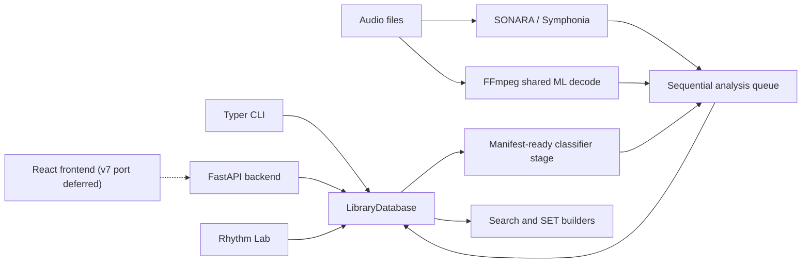

# Architecture map

> Audience: Developers orienting in the repository.
> Goal: See main components and data flow without reading every module first.
> Type: explanation

## Map

## Code map

- `database.py`, `db_connection.py`, `db_schema_v7.py`, `db_artifacts.py`, `db_evaluation_sidecar.py`, `db_storage.py`, and `db_analysis*.py` cover Core, required Artifacts, and optional Evaluation. These modules also handle analysis persistence, contract queries, resets, and clear.
- `scanner.py`: supported audio discovery and Mutagen metadata reads.
- `analysis_queue.py`: one sequential worker shared by manual and pipeline analysis stages.
- `analysis_jobs.py` and `sonara_features.py`: separate ML jobs, native batched SONARA capture, and
  phase timing. A SONARA batch is persisted in one transaction with a savepoint per track.
- `analysis_pipeline.py`: fixed SONARA, ML, CLASSIFIERS parent/child orchestration.
- `sonara_contract.py`: version, schema, profile, signature, and current-analysis compatibility.
- `tempo_resolution.py` and `track_resolution.py`: confidence-aware BPM and Camelot/key resolution.
- `search.py`, `sonara_similarity*.py`, `set_builder.py`, and `transition_diagnostics.py`: search, SET ordering, and transition-risk logic.
- `classifier_manifest.py`, `classifier_scoring.py`, and `classifier_jobs.py`: promoted artifact validation, manifest-specific readiness, aggregate progress, and database-only scoring.
- `api_routes_*.py`: FastAPI route groups.
- `frontend/src/`: pre-v7 API mirror and UI panels. The v7 port is deferred.

Selecting a fresh `library.sqlite` path creates schema-v7 Core and mandatory
`library.artifacts.sqlite`, bound by one `catalog_uuid`. Optional
`library.evaluation.sqlite` is created only by evaluation workflows. Core stores catalog, track,
tags, contracts, compact analysis rows, scores, likes, feedback, and FTS. Artifacts stores dedicated
MAEST/MERT/MuQ/CLAP embeddings plus SONARA `timeline`, `embedding`, and `fingerprint` outputs. A
non-v7 or incomplete bundle fails closed. There is no runtime migration path.
