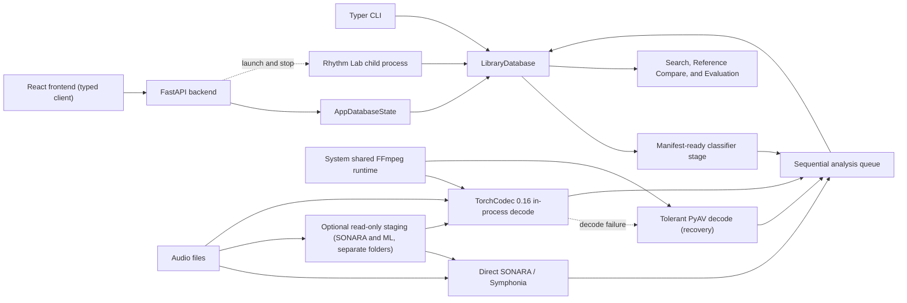

# Architecture map

How the pieces fit together, from the CLI and the API down to the audio decode paths.

## Map

```mermaid
flowchart LR
    CLI[Typer CLI] --> DB[LibraryDatabase]
    API[FastAPI backend] --> State[AppDatabaseState]
    State --> DB
    UI["React frontend (typed client)"] --> API
    Audio[Audio files] --> Sonara[Direct SONARA / Symphonia]
    Audio --> Stage["Optional read-only staging (SONARA and ML, separate folders)"]
    Stage --> Sonara
    Stage --> TorchCodec
    SharedFFmpeg["System shared FFmpeg runtime"] --> TorchCodec[TorchCodec 0.16 in-process decode]
    SharedFFmpeg --> PyAV["Tolerant PyAV decode (recovery)"]
    Audio --> TorchCodec
    TorchCodec -. decode failure .-> PyAV
    PyAV --> Queue
    Sonara --> Queue[Sequential analysis queue]
    TorchCodec --> Queue
    Queue --> DB
    DB --> Classifiers[Manifest-ready classifier stage]
    Classifiers --> Queue
    DB --> Search[Search, Reference Compare, and Evaluation]
    API -. launch and stop .-> Lab[Rhythm Lab child process]
    Lab --> DB
```

## Concurrency contract

`api_state.AppDatabaseState` owns manager lifetimes and every concurrency decision. Every route
touches it, so a change here reaches the whole backend.

| Call | Raises | Meaning |
| --- | --- | --- |
| `require_db()` | `DatabaseNotSelected` to `400` | No database chosen yet. |
| `require_idle_db(op)` | `DatabaseBusy` to `409` | Any manager reports a queued or running job. The check scans all managers, so a long Audio Dedup scan blocks an unrelated database switch. |
| `exclusive_db(op)` | `DatabaseBusy` to `409` | A stronger reservation for clear, delete, reset, relocate apply, genre writes, and dedup delete. It blocks a database switch and any job start for its duration. |
| `job_start()` | `DatabaseBusy` | Holds the state lock across manager lookup plus `start()`, closing a check-then-act race. |

`analysis_queue.AnalysisStageQueue` is one daemon thread with an unbounded queue, shared by the
analysis manager and the classifier manager, so SONARA, ML, and classifier stages are strictly
serialized inside a process.

`job_runtime.JobStore` backs all six job managers. It copies a status on every read and caps its
event ring at 200 entries per job. It never evicts a job, so a long-lived server keeps one status
object per job for the life of the process.

## Code map

- `database.py`, `db_connection.py`, `db_schema.py`, `db_ddl.py`, `db_embeddings.py`, `db_evaluation_sidecar.py`, `db_storage.py`, and `db_analysis*.py` cover the library and optional Evaluation sidecar. These modules also handle identity validation, analysis persistence, resets, and clear. `LibraryDatabase` is a mixin composition over `TrackRepository`, `AnalysisRepository`, `SummaryRepository`, and `EvaluationRepository`, and it is the only SQLite write gateway.
- `db_library_queries.py` is the largest read-path module and backs the track list, track detail, filtered lists, export, and the liked-state write.
- `scanner.py`: supported audio discovery and Mutagen metadata reads.
- `analysis_queue.py`: one sequential worker shared by manual and pipeline analysis stages.
- `ffmpeg_runtime.py`: validates FFmpeg `8.1.1` as a full shared runtime in this order:
  `DJ_TRACK_SIMILARITY_FFMPEG_SHARED_DIR`, then `PATH`. A valid Windows candidate has `ffmpeg.exe`
  plus the required ABI-8 DLL set. It registers that
  directory for the process on Windows, loads pinned PyAV `17.1.0` from the active environment,
  and powers `dj-sim doctor`. The project does not version or vendor FFmpeg.
- `audio_loader.py`: one lazy TorchCodec `0.16` decode shared by the generic ML families calls
  `AudioDecoder(path, num_channels=1).get_all_samples()`. It returns the whole track as mono
  `float32` at its source sample rate, keeps `AudioSamples.data[0]` as a 1D CPU `torch.float32`
  tensor in `DecodedAudio`, and passes that tensor directly to the adapters. When the full decode
  fails, `_load_with_shared_ffmpeg` hands the file to `shared_ffmpeg_decoder.load_tolerant_mono_audio`,
  which decodes with PyAV over the same shared FFmpeg libraries, discards malformed packets, and
  takes the arithmetic channel mean for mono `float32` PCM before it is wrapped back into a tensor;
  the adapter still owns resampling and window selection. The recovery step is a different decoder
  from the primary one, so a file TorchCodec rejects is not simply retried the same way.
  `WavDecoder` is not used because it cannot request channel remixing in TorchCodec `0.16`.
- `analysis_jobs.py`, `analysis_model_runners.py`, `sonara_staging.py`, `ml_staging.py`, and
  `sonara_features.py`: separate ML jobs plus Direct or Staged capture for both SONARA and the ML
  families. Direct Mode reads source paths in configured native batches. SONARA Staged Mode copies
  source files read-only to a user-selected temporary directory and runs a bounded, barrier-free
  ready queue through configurable Rayon-limited worker processes. ML Staged Mode is separate code
  with its own folder, copy workers, and decode workers, reachable from the pipeline
  API and from `dj-sim analyze --ml-staged`. Both SONARA modes use the same per-file tolerant PyAV
  shared-library PCM recovery only after native SONARA decode or codec failures. Results
  retain source identity, and a track's SONARA Core, embedding, and fingerprint rows are written
  under one savepoint inside a single transaction.
- `analysis_pipeline.py`: fixed SONARA then ML parent/child orchestration.
- `sonara_runtime.py`: current SONARA Core feature and embedding selection.
- `tempo_resolution.py` and `track_resolution.py`: confidence-aware BPM and Camelot/key resolution.
- `search.py`, `sonara_similarity*.py`, and `transition_diagnostics.py`: search and transition-risk diagnostics.
- `classifier_manifest.py`, `classifier_scoring.py`, and `classifier_jobs.py`: promoted artifact validation, manifest-specific readiness, and database-only scoring for one classifier at a time.
- `api_routes_*.py`: FastAPI route groups. `api.py` holds only the dialogs, `reveal_track_file`, the
  text-adapter cache wiring, and route registration.
- `rhythm_lab_launcher.py`: starts and stops the Rhythm Lab child process with list-based
  `subprocess.Popen` and `shell=False`, writes a PID file, and binds the current catalog UUID before
  reuse.
- `frontend/src/`: the typed API client (`api.ts` plus `apiClient.ts`), state coordinators
  (`useLibraryState`, `useSearchPlaylist`, `useAudioDedup`, `searchSurfaceState`), persisted
  settings modules (`sonaraAnalysisSettings`, `mlAnalysisSettings`, `theme`), the prompt bank
  (`textPromptPresets`), and the React panels `LibraryPanel`, `TrackPanel`, `SearchPlaylistPanel`
  with their dialogs. `App.tsx` composes those workflows rather than holding them.

## The library-vector cache

`db_analysis.py` keeps one in-process cache of library embedding matrices with a 512 MiB budget.
Every transaction that writes an embedding table bumps `PRAGMA user_version` before it commits, and
a search compares that counter plus the row counts against the values its cached matrix was built
from. The counter is a write generation rather than a schema version, and no table or column carries
it. Read the [Database reference](../reference/database.md) before treating it as schema.

Selecting a fresh `library.sqlite` path creates the one library schema, including catalog, tracks,
tags, analysis rows, SONARA/MAEST/MERT/MuQ/MuQ-MuLan/CLAP embeddings, scores, likes, feedback, and FTS. Optional
`library.evaluation.sqlite` is created only by Evaluation workflows. A legacy split layout fails
closed. Normal startup never migrates it. The only migration path is the confirmation-gated
`dj-sim migrate-database` command, which stages and verifies one replacement file while preserving
the original pair in a timestamped backup directory.
