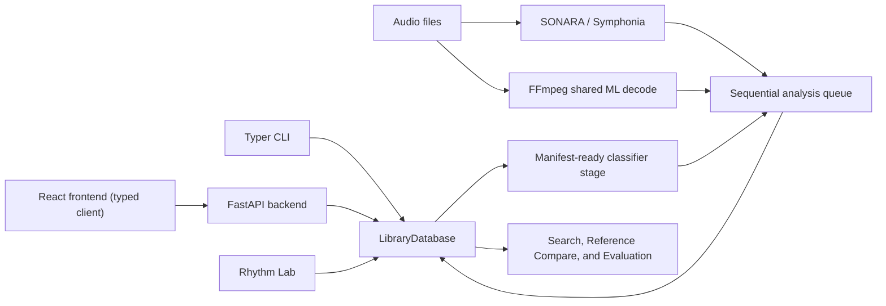

# Architecture map

> Audience: Developers orienting in the repository.
> Goal: See main components and data flow without reading every module first.
> Type: explanation

## Map

```mermaid
flowchart LR
    CLI[Typer CLI] --> DB[LibraryDatabase]
    API[FastAPI backend] --> DB
    UI["React frontend (typed client)"] --> API
    Audio[Audio files] --> Sonara[SONARA / Symphonia]
    Audio --> FFmpeg[FFmpeg shared ML decode]
    Sonara --> Queue[Sequential analysis queue]
    FFmpeg --> Queue
    Queue --> DB
    DB --> Classifiers[Manifest-ready classifier stage]
    Classifiers --> Queue
    DB --> Search[Search, Reference Compare, and Evaluation]
    Lab[Rhythm Lab] --> DB
```

## Code map

- `database.py`, `db_connection.py`, `db_schema.py`, `db_structure.py`, `db_artifacts.py`, `db_evaluation_sidecar.py`, `db_storage.py`, and `db_analysis*.py` cover Core, required Artifacts, and optional Evaluation. These modules also handle structural validation, analysis persistence, resets, and clear.
- `scanner.py`: supported audio discovery and Mutagen metadata reads.
- `analysis_queue.py`: one sequential worker shared by manual and pipeline analysis stages.
- `analysis_jobs.py` and `sonara_features.py`: separate ML jobs, native batched SONARA capture, and
  phase timing. A SONARA batch is persisted in one transaction with a savepoint per track.
- `analysis_pipeline.py`: fixed SONARA then ML parent/child orchestration.
- `sonara_runtime.py`: current SONARA Core feature selection.
- `tempo_resolution.py` and `track_resolution.py`: confidence-aware BPM and Camelot/key resolution.
- `search.py`, `sonara_similarity*.py`, and `transition_diagnostics.py`: search and transition-risk diagnostics.
- `classifier_manifest.py`, `classifier_scoring.py`, and `classifier_jobs.py`: promoted artifact validation, manifest-specific readiness, and database-only scoring for one classifier at a time.
- `api_routes_*.py`: FastAPI route groups.
- `frontend/src/`: typed API client, library/search state coordinators, and React UI panels.

Selecting a fresh `library.sqlite` path creates Core and mandatory `library.artifacts.sqlite`, bound
by one `catalog_uuid`. Optional
`library.evaluation.sqlite` is created only by evaluation workflows. Core stores catalog, track,
tags, compact analysis rows, scores, likes, feedback, and FTS. Artifacts stores dedicated
MAEST/MERT/MuQ/CLAP embeddings plus empty reserved SONARA artifact tables. A
structurally incompatible or incomplete bundle fails closed. Normal startup never migrates it;
`dj-sim migrate-database` is the explicit backup-first maintenance path.
