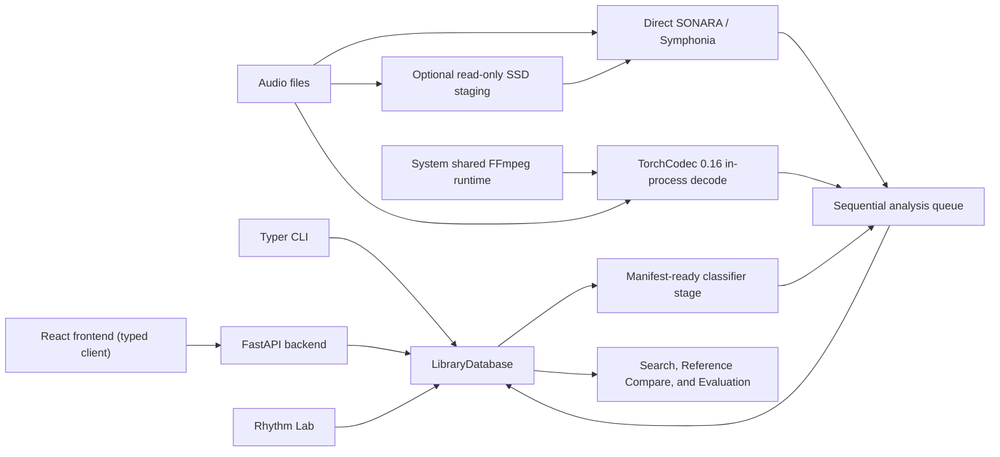

# Architecture map

> Audience: Developers orienting in the repository.
> Goal: See main components and data flow without reading every module first.
> Type: explanation

## Map

```mermaid
flowchart LR
    CLI[Typer CLI] --> DB[LibraryDatabase]
    API[FastAPI backend] --> DB
    UI["React frontend (typed client)"] --> API
    Audio[Audio files] --> Sonara[Direct SONARA / Symphonia]
    Audio --> Stage[Optional read-only SSD staging]
    Stage --> Sonara
    SharedFFmpeg["System shared FFmpeg runtime"] --> TorchCodec[TorchCodec 0.16 in-process decode]
    Audio --> TorchCodec
    Sonara --> Queue[Sequential analysis queue]
    TorchCodec --> Queue
    Queue --> DB
    DB --> Classifiers[Manifest-ready classifier stage]
    Classifiers --> Queue
    DB --> Search[Search, Reference Compare, and Evaluation]
    Lab[Rhythm Lab] --> DB
```

## Code map

- `database.py`, `db_connection.py`, `db_schema.py`, `db_embeddings.py`, `db_evaluation_sidecar.py`, `db_storage.py`, and `db_analysis*.py` cover the library and optional Evaluation sidecar. These modules also handle identity validation, analysis persistence, resets, and clear.
- `scanner.py`: supported audio discovery and Mutagen metadata reads.
- `analysis_queue.py`: one sequential worker shared by manual and pipeline analysis stages.
- `ffmpeg_runtime.py`: resolves a system-available shared FFmpeg library directory from
  `DJ_TRACK_SIMILARITY_FFMPEG_SHARED_DIR` or `PATH`, and registers that directory for the process
  on Windows. The project does not bundle FFmpeg or invoke `ffmpeg.exe` for its main runtime.
- `audio_loader.py`: one lazy TorchCodec `0.16` decode shared by the generic ML families calls
  `AudioDecoder(path, num_channels=1).get_all_samples()`. It returns the whole track as mono
  `float32` at its source sample rate, keeps `AudioSamples.data[0]` as a 1D CPU `torch.float32`
  tensor in `DecodedAudio`, and passes that tensor directly to the adapters. When the full decode
  fails, the model runner makes a second in-process TorchCodec read using the same shared FFmpeg
  libraries, then takes the arithmetic channel mean for mono `float32` PCM; the adapter still owns
  resampling and window selection. `WavDecoder` is not used because it
  cannot request channel remixing in TorchCodec `0.16`.
- `analysis_jobs.py`, `analysis_model_runners.py`, `sonara_staging.py`, and `sonara_features.py`:
  separate ML jobs plus Direct or Staged native SONARA capture. Direct Mode reads source paths in
  configured native batches. Staged Mode copies source files read-only to a user-selected temporary
  directory and runs a bounded, barrier-free ready queue through configurable Rayon-limited worker
  processes. Both modes use per-file direct shared-library PCM recovery only after native SONARA
  decode or codec failures. Results
  retain source identity; SONARA Core and embedding data use one transaction with a savepoint per
  track.
- `analysis_pipeline.py`: fixed SONARA then ML parent/child orchestration.
- `sonara_runtime.py`: current SONARA Core feature and embedding selection.
- `tempo_resolution.py` and `track_resolution.py`: confidence-aware BPM and Camelot/key resolution.
- `search.py`, `sonara_similarity*.py`, and `transition_diagnostics.py`: search and transition-risk diagnostics.
- `classifier_manifest.py`, `classifier_scoring.py`, and `classifier_jobs.py`: promoted artifact validation, manifest-specific readiness, and database-only scoring for one classifier at a time.
- `api_routes_*.py`: FastAPI route groups.
- `frontend/src/`: typed API client, library/search state coordinators, and React UI panels.

Selecting a fresh `library.sqlite` path creates the one library schema, including catalog, tracks,
tags, analysis rows, SONARA/MAEST/MERT/MuQ/CLAP embeddings, scores, likes, feedback, and FTS. Optional
`library.evaluation.sqlite` is created only by Evaluation workflows. A legacy split layout fails
closed. Normal startup never migrates it. The only migration path is the confirmation-gated
`dj-sim migrate-database` command, which stages and verifies one replacement file while preserving
the original pair in a timestamped backup directory.
