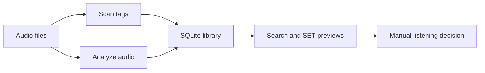

# Find the next track without giving up your library

> Audience: DJs, collectors, and power users opening the docs for the first time.
> Goal: Understand what dj-track-similarity is, why it is useful, and where to go next.
> Type: explanation

`dj-track-similarity` is a local-first music-library helper. It scans tags, stores analysis in SQLite, and helps you find candidates for crates, transitions, text prompts, and set previews. It is a public personal utility, not a commercial recommendation engine or research benchmark.

## What it gives you

- A local SQLite view of your library with readable tags and analysis coverage.
- SONARA audio features plus MERT, MAEST, and CLAP embeddings for comparison.
- Seed search, CLAP text search, Smart Set Builder previews, and optional Rhythm Lab classifiers.

## Data flow

## Safety in one sentence

Most app workflows read audio and write SQLite only. The explicit exceptions are MAEST genre tag apply, audio repair `--apply`, and Audio Dedup apply/delete; relocation apply updates stored SQLite paths only.

## Start here

- [Getting started](./getting-started/index.md) — install, scan, analyze, and see the first useful results.
- [User guide](./user-guide/index.md) — daily UI work: browse, search, sets, exports, and safe tag writes.
- [Workflows](./workflows/index.md) — DJ-shaped recipes for preparing a set or maintaining a collection.
- [Concepts](./concepts/index.md) — plain explanations of features, embeddings, scores, and routing.
- [Tools and scripts](./tools-and-scripts/index.md) — Rhythm Lab, duplicate reports, repair helper, and database optimization.
- [Reference](./reference/index.md) — concise CLI, API, database, config, analysis, and UI facts.
- [Developer](./developer/index.md) — architecture, local development, verification, and release checks.
- [Help](./help/index.md) — troubleshooting, FAQ, and current limits.

Russian first-pass localization is available at [Русская версия](./ru/index.md).
