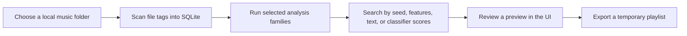

<!-- markdownlint-disable MD033 MD041 -->

<section class="dts-hero" aria-labelledby="dts-hero-title">
  

    <h1 id="dts-hero-title">DJ Track Similarity</h1>
    

      Local DJ library analysis for building searchable crates, checking
      similar tracks, and preparing set ideas without uploading audio.
    

    

      <a
        class="dts-button dts-button-brand"
        href="/docs/getting-started/quickstart.html"
      >Start here</a>
      <a class="dts-button" href="/docs/user-guide/">Use the UI</a>
      <a class="dts-button" href="/docs/reference/">Reference</a>
    

  

  

    

      local session
      <strong>safe by default</strong>
    

    

      scan
      <strong>tags -> SQLite</strong>
    

    

      analyze
      <strong>SONARA / MERT / CLAP / MAEST</strong>
    

    

      audition
      <strong>seed search, text search, SET preview</strong>
    

    

      audio files
      <strong>unchanged unless you choose an explicit write workflow</strong>
    

  

</section>

<section class="dts-workbench" aria-labelledby="dts-workbench-title">
  

    
Local workflow surface

    <h2 id="dts-workbench-title">From crate to shortlist, with the risky steps
      separated.</h2>
    

      The docs are organized around the workbench you actually use: scan a
      small folder, analyze what is missing, audition candidates, then export a
      reviewed list. File writes and deletes stay outside the normal path.
    

  

  <ol class="dts-signal-chain" aria-label="Main documentation workflow">
    <li>
      01
      <strong>Scan</strong>
      tags -> SQLite
    </li>
    <li>
      02
      <strong>Analyze</strong>
      SONARA / MERT / CLAP / MAEST
    </li>
    <li>
      03
      <strong>Audition</strong>
      seed search and SET preview
    </li>
    <li>
      04
      <strong>Export</strong>
      reviewed playlist or report
    </li>
  </ol>
</section>

<section class="dts-status-board" aria-label="Documentation safety boundaries">
  

    Normal path
    <strong>Read-only toward audio</strong>
    
Browse, preview, search, SET, reset, and export do not rewrite source
      files.

  

  

    Explicit write
    <strong>Genre tags only</strong>
    
MAEST genre labels can be written only through the documented tag-write
      workflow.

  

  

    Maintenance
    <strong>Dry-run before apply</strong>
    
Repair and dedup workflows start with reports and keep apply modes
      separate.

  

</section>

## What this project is

`dj-track-similarity` is a local-first tool for DJs, music collectors, and
power users who work with local audio files. It scans your library into a
SQLite database, runs optional audio analysis, and gives you a browser UI for
browsing, searching, building temporary set ideas, and exporting playlists.

It is a personal enthusiast project, not a polished commercial product and not
a formal research benchmark. Treat scores as useful ranking hints, then make
the musical decision yourself.

## Where to go first

| If you want to... | Start with |
| --- | --- |
| install and see the UI | [Quickstart](getting-started/quickstart.md) |
| understand the safety model | [Local-first safety](concepts/local-first-safety.md) |
| browse and search from the UI | [User guide](user-guide/index.md) |
| prepare a set idea | [Prepare a set](workflows/prepare-a-set.md) |
| use CLI/API/database details | [Reference](reference/index.md) |
| fix common setup issues | [Troubleshooting](help/troubleshooting.md) |

## The normal path

Scanning and analysis create local database state. Search and Smart Set Builder
produce previews. Export writes playlist/report files. Source audio stays
unchanged unless you choose a documented tag-writing, repair, or duplicate
apply workflow.
