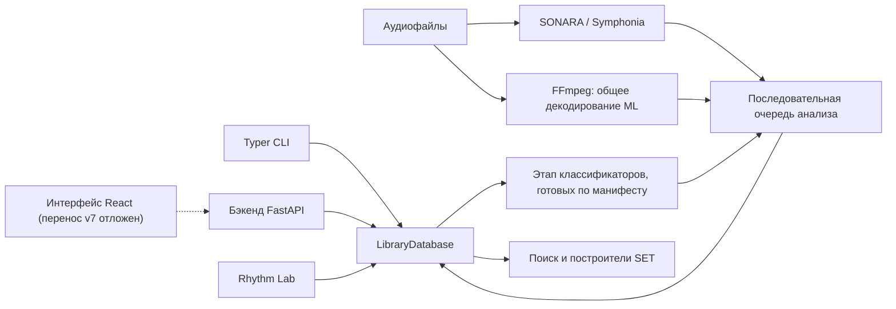

# Карта архитектуры

> Для кого: Разработчики, которые ориентируются в репозитории.
> Задача: Увидеть основные компоненты и поток данных до чтения каждого модуля.
> Тип: Объяснение

## Карта

## Карта кода

- `database.py`, `db_connection.py`, `db_schema_v7.py`, `db_artifacts.py`, `db_evaluation_sidecar.py`, `db_storage.py` и `db_analysis*.py` описывают Core, обязательную Artifacts и необязательную Evaluation. Эти модули также сохраняют результаты анализа, проверяют контракты, выполняют сброс и очистку.
- `scanner.py`: поиск поддерживаемого аудио и чтение метаданных Mutagen.
- `analysis_queue.py`: один последовательный обработчик для ручных и конвейерных этапов анализа.
- `analysis_jobs.py` и `sonara_features.py`: отдельные задачи ML, нативный пакетный сбор SONARA и замеры длительности этапов. Пакет SONARA сохраняется одной транзакцией с точкой сохранения для каждого трека.
- `analysis_pipeline.py`: фиксированное управление родительской задачей и дочерними этапами SONARA, ML, CLASSIFIERS.
- `sonara_contract.py`: версия, схема, профиль, сигнатура и совместимость анализа.
- `tempo_resolution.py` и `track_resolution.py`: определение BPM и Camelot/тональности с учётом достоверности.
- `search.py`, `sonara_similarity*.py`, `set_builder.py` и `transition_diagnostics.py`: поиск, порядок SET и риск перехода.
- `classifier_manifest.py`, `classifier_scoring.py` и `classifier_jobs.py`: проверка опубликованных артефактов, готовность по манифесту, общий прогресс и расчёт оценок только по базе.
- `api_routes_*.py`: группы маршрутов FastAPI.
- `frontend/src/`: клиент API до v7 и панели. Перенос на v7 отложен.

Для нового пути `library.sqlite` создаются Core v7 и обязательная `library.artifacts.sqlite` с общим
`catalog_uuid`. Необязательную `library.evaluation.sqlite` создают только сценарии оценки. Core
хранит каталог, треки, теги, контракты, компактные результаты, оценки, отметки, обратную связь и
FTS. В Artifacts находятся отдельные эмбеддинги MAEST/MERT/MuQ/CLAP и результаты SONARA `timeline`,
`embedding`, `fingerprint`. Неполный комплект или база не v7 блокируется. Миграции рабочей схемы
нет.
