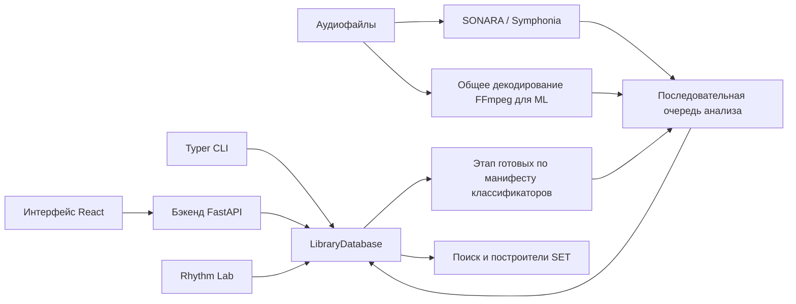

# Карта архитектуры

> Для кого: Для разработчиков, которые ориентируются в репозитории.
> Задача: Увидеть основные компоненты и поток данных до чтения каждого модуля.
> Тип: Объяснение

## Карта

## Карта кода

- `database.py`, `db_schema.py`, `db_storage.py` и `db_analysis*.py` описывают Core и подключённые дополнительные схемы, сохранение анализа, запросы сигнатур, кэши, сброс и очистку.
- `scanner.py`: поиск поддерживаемого аудио и чтение метаданных Mutagen.
- `analysis_queue.py`: один последовательный worker для ручных и конвейерных этапов.
- `analysis_jobs.py` и `sonara_features.py`: отдельные ML-задачи, нативный пакетный сбор SONARA и время фаз. Партия SONARA сохраняется одной транзакцией с savepoint на трек.
- `analysis_pipeline.py`: фиксированная родительско-дочерняя оркестрация SONARA, ML, CLASSIFIERS.
- `sonara_contract.py`: версия, схема, профиль, сигнатура и совместимость анализа.
- `tempo_resolution.py` и `track_resolution.py`: разрешение BPM и Camelot/тональности с учётом уверенности.
- `search.py`, `sonara_similarity*.py`, `set_builder.py` и `transition_diagnostics.py`: поиск, порядок SET и риск перехода.
- `classifier_manifest.py`, `classifier_scoring.py` и `classifier_jobs.py`: проверка опубликованных артефактов, готовность по манифесту, совокупный прогресс и расчёт только в базе.
- `api_routes_*.py`: группы маршрутов FastAPI.
- `frontend/src/`: зеркало API и панели интерфейса.

Выбранный `library.sqlite` — база Core. Одна индексированная таблица `embeddings` хранит эмбеддинги
MAEST, MERT, MuQ и CLAP для поиска и ранжирования. Полные временные массивы SONARA находятся в
`library.timeline.sqlite`, необязательные эмбеддинг и отпечаток SONARA — в
`library.representations.sqlite`. Каждое соединение подключает соответствующую пару и проверяет
общий идентификатор каталога. Горячие строки поиска содержат лёгкие поля SONARA и два списка имён;
поиск, SET и классификаторы никогда не загружают Timeline.
