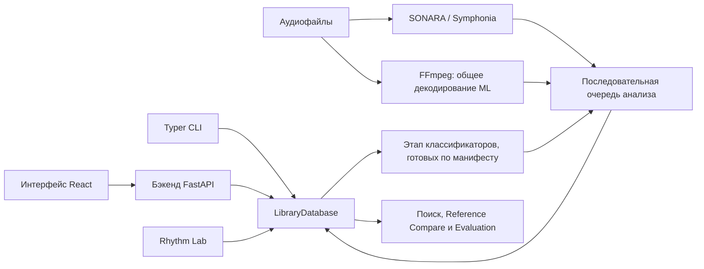

# Карта архитектуры

> Для кого: Разработчики, которые ориентируются в репозитории.
> Задача: Увидеть основные компоненты и поток данных до чтения каждого модуля.
> Тип: Объяснение

## Карта

```mermaid
flowchart LR
    CLI[Typer CLI] --> DB[LibraryDatabase]
    API[Бэкенд FastAPI] --> DB
    UI["Интерфейс React"] --> API
    Audio[Аудиофайлы] --> Sonara[SONARA / Symphonia]
    Audio --> FFmpeg[FFmpeg: общее декодирование ML]
    Sonara --> Queue[Последовательная очередь анализа]
    FFmpeg --> Queue
    Queue --> DB
    DB --> Classifiers[Этап классификаторов, готовых по манифесту]
    Classifiers --> Queue
    DB --> Search[Поиск, Reference Compare и Evaluation]
    Lab[Rhythm Lab] --> DB
```

## Карта кода

- `database.py`, `db_connection.py`, `db_schema.py`, `db_structure.py`,
  `db_artifacts.py`, `db_evaluation_sidecar.py`, `db_storage.py` и `db_analysis*.py`
  описывают Core, обязательную Artifacts и необязательную Evaluation. Эти модули также
  сохраняют результаты анализа, проверяют структуру, выполняют сброс и очистку.
- `scanner.py`: поиск поддерживаемого аудио и чтение метаданных Mutagen.
- `analysis_queue.py`: один последовательный обработчик для ручных и конвейерных этапов анализа.
- `analysis_jobs.py` и `sonara_features.py`: отдельные задачи ML, нативный пакетный сбор SONARA и замеры длительности этапов. Пакет SONARA сохраняется одной транзакцией с точкой сохранения для каждого трека.
- `analysis_pipeline.py`: фиксированное управление родительской задачей и дочерними этапами SONARA, ML, CLASSIFIERS.
- `sonara_runtime.py`: текущий набор результатов и параметры запуска SONARA.
- `tempo_resolution.py` и `track_resolution.py`: определение BPM и Camelot/тональности с учётом достоверности.
- `search.py`, `sonara_similarity*.py` и `transition_diagnostics.py`: поиск и диагностика риска перехода.
- `classifier_manifest.py`, `classifier_scoring.py` и `classifier_jobs.py`: проверка опубликованных артефактов, готовность по манифесту, общий прогресс и расчёт оценок только по базе.
- `api_routes_*.py`: группы маршрутов FastAPI.
- `frontend/src/`: клиент API, координаторы состояния фонотеки и поиска, панели React.

Для нового пути `library.sqlite` создаются Core и обязательная `library.artifacts.sqlite` с общим
`catalog_uuid`. Необязательную `library.evaluation.sqlite` создают только сценарии оценки. Core
хранит каталог, треки, теги, компактные результаты, оценки, отметки, обратную связь и
FTS. В Artifacts находятся отдельные эмбеддинги MAEST/MERT/MuQ/CLAP и пустые зарезервированные
таблицы SONARA. Неполный комплект или несовместимая структура блокируются. Обычный
запуск ничего не мигрирует: для преобразования старой пары предназначена только явная команда
`dj-sim migrate-database`.
