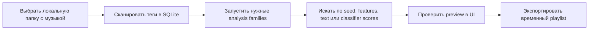

<!-- markdownlint-disable MD033 MD041 -->

<section class="dts-hero" aria-labelledby="dts-hero-title">
  

    <h1 id="dts-hero-title">DJ Track Similarity</h1>
    

      Локальный анализ DJ-библиотеки: соберите searchable crates, ищите похожие
      треки по звуку и готовьте идеи сетов без загрузки аудио наружу.
    

    

      <a
        class="dts-button dts-button-brand"
        href="/docs/ru/getting-started/quickstart.html"
      >Начать</a>
      <a class="dts-button" href="/docs/ru/user-guide/">UI-гайд</a>
      <a class="dts-button" href="/docs/ru/reference/">Reference</a>
    

  

  

    

      local session
      <strong>safe by default</strong>
    

    

      scan
      <strong>tags -> SQLite</strong>
    

    

      analyze
      <strong>SONARA / MERT / CLAP / MAEST</strong>
    

    

      audition
      <strong>seed search, text search, SET preview</strong>
    

    

      audio files
      <strong>unchanged unless you choose an explicit write workflow</strong>
    

  

</section>

<section class="dts-workbench" aria-labelledby="dts-workbench-title">
  

    
Local workflow surface

    <h2 id="dts-workbench-title">От crate к shortlist, с рискованными шагами
      отдельно.</h2>
    

      Документация теперь строится вокруг реального workbench: просканировать
      маленькую папку, добрать недостающий анализ, прослушать кандидатов и
      экспортировать проверенный список. File writes и deletes вынесены из
      обычного пути.
    

  

  <ol class="dts-signal-chain" aria-label="Main documentation workflow">
    <li>
      01
      <strong>Scan</strong>
      tags -> SQLite
    </li>
    <li>
      02
      <strong>Analyze</strong>
      SONARA / MERT / CLAP / MAEST
    </li>
    <li>
      03
      <strong>Audition</strong>
      seed search and SET preview
    </li>
    <li>
      04
      <strong>Export</strong>
      reviewed playlist or report
    </li>
  </ol>
</section>

<section class="dts-status-board" aria-label="Documentation safety boundaries">
  

    Normal path
    <strong>Read-only toward audio</strong>
    
Browse, preview, search, SET, reset and export не переписывают source
      files.

  

  

    Explicit write
    <strong>Genre tags only</strong>
    
MAEST genre labels пишутся только через documented tag-write workflow.

  

  

    Maintenance
    <strong>Dry-run before apply</strong>
    
Repair and dedup workflows начинаются с reports и держат apply modes
      отдельно.

  

</section>

## Что это за проект

`dj-track-similarity` - локальный инструмент для DJs, коллекционеров музыки и
power users, которые работают с локальными аудиофайлами. Он сканирует
библиотеку в SQLite, запускает опциональный аудиоанализ и дает browser UI для
просмотра, поиска, подготовки временных сетов и экспорта плейлистов.

Это персональный enthusiast-проект, а не коммерческий продукт и не research
benchmark. Оценки похожести полезны как подсказки для ранжирования, но
финальное музыкальное решение остается за вами.

## Куда идти сначала

| Если нужно... | Начните с |
| --- | --- |
| установить и открыть UI | [Quickstart](getting-started/quickstart.md) |
| понять safety model | [Local-first safety](concepts/local-first-safety.md) |
| искать и слушать из UI | [User guide](user-guide/index.md) |
| подготовить идею сета | [Prepare a set](workflows/prepare-a-set.md) |
| найти CLI/API/DB детали | [Reference](reference/index.md) |
| починить частые ошибки | [Troubleshooting](help/troubleshooting.md) |

## Обычный путь

Сканирование и анализ создают локальное состояние базы. Поиск и Smart Set
Builder создают preview. Export пишет playlist/report файлы. Исходное аудио не
меняется, кроме явно выбранных workflows для записи тегов, repair или duplicate
apply.
