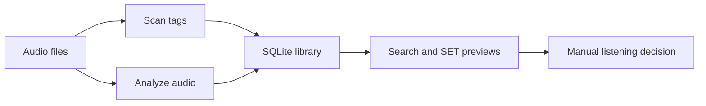

# Найти следующий трек, не отдавая библиотеку наружу

> Audience: диджеи, коллекционеры и опытные пользователи.
> Goal: Понять, что делает dj-track-similarity и куда идти дальше.
> Type: explanation

`dj-track-similarity` — локальный помощник для музыкальной библиотеки. Он читает теги и аудио, хранит результаты анализа в SQLite и помогает искать похожие треки, строить SET previews, пользоваться CLAP text search и подключать личные classifiers. Это личный открытый проект для практической работы с коллекцией, а не коммерческий рекомендательный сервис.

## Как идут данные

## Безопасность

Обычные сценарии читают аудио и пишут только SQLite. Явные исключения: genre tag apply, audio repair `--apply`, Audio Dedup apply/delete. Relocation apply меняет только сохранённые пути в SQLite.

## Разделы

- [Первые шаги](./getting-started/index.md) — установка, `scan`, анализ и первый полезный результат.
- [Руководство](./user-guide/index.md) — ежедневная работа в UI: библиотека, поиск, SET, экспорт и безопасные записи тегов.
- [Сценарии](./workflows/index.md) — практические маршруты для подготовки сета и обслуживания коллекции.
- [Концепции](./concepts/index.md) — понятные объяснения features, embeddings, scores и routing.
- [Инструменты](./tools-and-scripts/index.md) — Rhythm Lab, отчёты о дублях, repair helper и оптимизация базы.
- [Reference](./reference/index.md) — краткие факты по CLI, API, базе, конфигурации, анализу и UI.
- [Разработчику](./developer/index.md) — architecture, local development, verification и release checks.
- [Помощь](./help/index.md) — troubleshooting, FAQ и текущие ограничения.

English version: [Home](../index.md).
