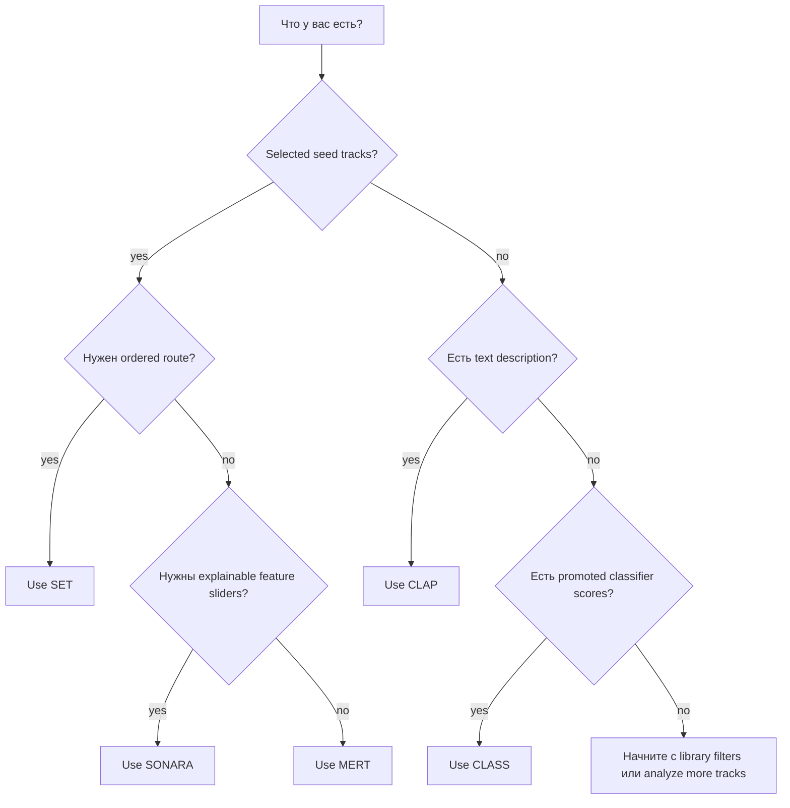

# Find compatible tracks

Аудитория: DJs, выбирающие search strategy  
Цель: решить, использовать SONARA, MERT, CLAP, SET или CLASS  
Тип: how-to

Проект дает несколько search surfaces, потому что один signal не может быть
правильным для всех DJ tasks.

## SONARA

Используйте SONARA, когда нужен feature-oriented search and controls. Он
полезен для energy, rhythm, tonal и других analyzed descriptors.

SONARA search требует stored SONARA features.

## MERT

Используйте MERT, когда есть seed tracks и нужны audio-embedding neighbors. Это
хороший default для вопроса "что звучит рядом с этим?".

MERT seed search требует stored MERT embeddings.

## CLAP

Используйте CLAP text search, когда можно описать target sound словами. Prompts
лучше работают как короткие musical descriptions, а не exact database queries.

CLAP text search требует CLAP embeddings.

## SET

Используйте SET, когда нужен ordered preview. SET требует feature-complete
candidates: SONARA plus MERT, MAEST and CLAP audio embeddings.

## CLASS

Используйте CLASS после promotion Rhythm Lab classifier profile и scoring main
library для этого profile. Missing scores остаются neutral.
