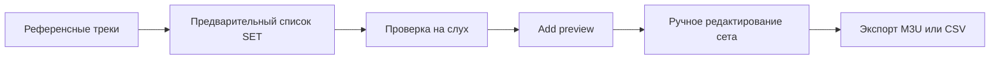

# Подготовьте сет из нескольких опорных точек

> Для кого: Для тех, кто собирает упорядоченный список кандидатов для прослушивания.
> Задача: Пройти от референсных треков (seed) до экспорта, не принимая предварительный список за окончательную истину.
> Тип: Сценарий

Этот сценарий подходит, если несколько треков уже задают направление, но полезного маршрута между
ними ещё нет. Результат — редактируемая последовательность кандидатов: достаточно структурированная
для начала репетиции или подготовки подборки, но не притворяющаяся окончательным порядком.

Вся работа выполняется в основном интерфейсе. После прослушивания вам почти наверняка захочется
убирать, заменять и переставлять треки.

## 1. Подготовьте просканированную и проанализированную фонотеку

Для SET выполните все основные семейства анализа:

```powershell
dj-sim analyze --models sonara --db .\data\library.sqlite
dj-sim analyze --models maest,mert,clap --db .\data\library.sqlite
```

Для участия в SET треку нужны данные SONARA, MERT, MAEST и CLAP.

## 2. Выберите референсные треки

Найдите в фонотеке треки, представляющие нужную область, и добавьте от одного до пяти референсных.

Не выбирайте два трека одного известного исполнителя для одного предварительного списка SET. Бэкенд допускает не
более одного трека каждого известного исполнителя.

## 3. Создайте предварительный список SET

Откройте вкладку SET.

- Выберите **Manual**, если выбранные референсные треки должны стать фиксированными опорными точками.
- Выберите **Auto**, если приложение должно подобрать опорные точки из подходящей части фонотеки.
- Задайте режим сета, кривую энергии, лимит и разнообразие.
- Включайте траекторию BPM только при осознанном подъёме или снижении темпа.
- Используйте предпочтения классификаторов только тогда, когда понимаете опубликованный профиль.

Нажмите **Generate**, затем проверьте покрытие и порядок предварительного списка.

## 4. Проверьте альтернативы

MERT покажет широкое окружение референсных треков. SONARA позволит направлять слышимые группы признаков.
CLAP поможет, если недостающее звучание легче описать словами. Hybrid покажет, какие источники
поддерживают кандидата и где риск перехода требует внимания.

## 5. Прослушайте

Прослушайте кандидатов и обратите внимание на:

- слишком большое число похожих треков;
- повторы исполнителей;
- провалы и скачки энергии;
- конфликты вокала;
- переходы тональности или темпа, которые выглядят верно в цифрах, но звучат неудачно.

## 6. Добавьте и экспортируйте

Нажмите **Add preview** только после того, как предварительный список стал полезным. Затем вручную отредактируйте
текущий сет и экспортируйте M3U или CSV.



## Безопасность

Создание SET работает только на чтение. Добавление предварительного списка меняет лишь состояние текущего сета в
браузере. Экспорт создаёт новый файл плейлиста, а не аудиотеги.
