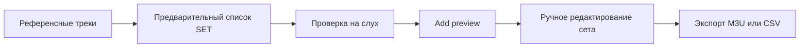

# Подготовьте сет из нескольких опорных точек

> Для кого: Для тех, кто собирает упорядоченный список кандидатов для прослушивания.
> Задача: Пройти от референсных треков (seed) до экспорта, не принимая предварительный список за окончательную истину.
> Тип: Сценарий

::: warning Состояние интерфейса v7
Описанный ниже сценарий React относится к отложенному интерфейсу. Он ещё не перенесён на API схемы
v7, поэтому эти шаги сейчас не проверены и недоступны для v7. Используйте приведённую ниже
альтернативу через CLI или API бэкенда.
:::

Этот сценарий подходит, если несколько треков уже задают направление, но полезного маршрута между
ними ещё нет. Результат — редактируемая последовательность кандидатов: достаточно структурированная
для начала репетиции или подготовки подборки, но не притворяющаяся окончательным порядком.

## Актуальная альтернатива v7

Расширьте набор опорных точек через `POST /api/search` или `POST /api/search/sonara`, затем передайте
выбранные ID треков в `POST /api/set-builder/generate`. Прослушивайте кандидатов через
`GET /media/{track_id}`. После проверки на слух и ручного отбора отправьте итоговые ID в
`POST /api/export`. Текстовый поиск CLAP также доступен через `dj-sim text-search`. Актуальные
контракты приведены в [справочнике API](../reference/api.md).

Поля источников и весов SET и Hybrid доступны через эти конечные точки бэкенда. Аналогичные элементы
React остаются частью отложенного переноса интерфейса.

## Сценарий отложенного интерфейса

Оставшаяся часть сценария использует отложенный основной интерфейс. После появления перенесённого
клиента React всё равно рассчитывайте убирать, заменять и переставлять треки после прослушивания.

## 1. Подготовьте просканированную и проанализированную фонотеку

Для SET выполните все основные семейства анализа:

```powershell
dj-sim analyze --models sonara --db .\data\library.sqlite
dj-sim analyze --models maest,mert,muq,clap --db .\data\library.sqlite
```

Запрос SET по умолчанию требует SONARA, MERT, MAEST, MuQ и CLAP. Если намеренно запросить только
`mert`, `maest` и `clap`, MuQ не загружается и не требуется для участия, а эффективные веса
сохраняют прежние значения `0.30`, `0.18`, `0.22` и `0.30` для MERT, MAEST, CLAP и широкого
сигнала SONARA.

## 2. Выберите референсные треки

Найдите в фонотеке треки, представляющие нужную область, и добавьте от одного до пяти референсных.

Не выбирайте два трека одного известного исполнителя для одного предварительного списка SET. Бэкенд допускает не
более одного трека каждого известного исполнителя.

## 3. Создайте предварительный список SET

Откройте вкладку SET.

- Выберите **Manual**, если выбранные референсные треки должны стать фиксированными опорными точками.
- Выберите **Auto**, если приложение должно подобрать опорные точки из подходящей части фонотеки.
- Задайте режим сета, кривую энергии, лимит и разнообразие.
- В клиенте API оставьте источники MERT, MAEST, MuQ и CLAP по умолчанию либо задайте явное подмножество.
- Включайте траекторию BPM только при осознанном подъёме или снижении темпа.
- Используйте предпочтения классификаторов только тогда, когда понимаете опубликованный профиль.

Нажмите **Generate**, затем проверьте покрытие и порядок предварительного списка.

## 4. Проверьте альтернативы

MERT покажет широкое окружение референсных треков. SONARA позволит направлять слышимые группы признаков.
CLAP поможет, если недостающее звучание легче описать словами. Hybrid покажет, какие источники
поддерживают кандидата и где риск перехода требует внимания. По умолчанию Hybrid использует
`mert`, `maest`, `muq`, `sonara` и `clap` с весом `0.20` для каждого.

## 5. Прослушайте

Прослушайте кандидатов и обратите внимание на:

- слишком большое число похожих треков;
- повторы исполнителей;
- провалы и скачки энергии;
- конфликты вокала;
- переходы тональности или темпа, которые выглядят верно в цифрах, но звучат неудачно.

## 6. Добавьте и экспортируйте

Нажмите **Add preview** только после того, как предварительный список стал полезным. Затем вручную отредактируйте
текущий сет и экспортируйте M3U или CSV.


```mermaid
flowchart LR
    A[Референсные треки] --> B[Предварительный список SET]
    B --> C[Проверка на слух]
    C --> D[Add preview]
    D --> E[Ручное редактирование сета]
    E --> F[Экспорт M3U или CSV]
```

## Безопасность

Создание SET работает только на чтение. Добавление предварительного списка меняет лишь состояние текущего сета в
браузере. Экспорт создаёт новый файл плейлиста, а не аудиотеги.
