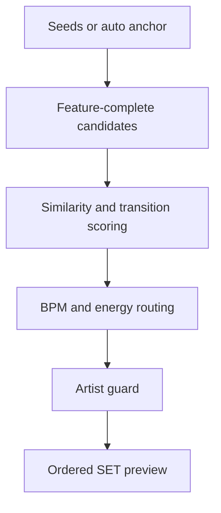

# Build a Smart Set preview

> Audience: DJs preparing an ordered listening route.
> Goal: Generate a SET preview and understand the controls that shape it.
> Type: how-to

Smart Set Builder is a preview generator. Use it to get an ordered listening route, then listen, prune, and add the preview to your current set only when you choose to.

## Route

## Requirements

The strongest SET path expects stored MERT, MAEST, and CLAP audio embeddings plus SONARA features. It may use MAEST embeddings, but not MAEST genre labels for selection.

## Seed source and set mode

- Use manual seeds when you already know one to five anchor tracks. This is best for a planned sound, label, time slot, or transition idea. Manual seeds with the same known artist are rejected so the preview starts diverse.
- Use auto seeds when you want the app to explore the feature-complete library. Auto mode picks the first anchor from analyzed tracks, then samples remaining waypoint anchors from related candidates.
- Use a similar-crate style mode when you want a tight group around the anchors. Use a more balanced route when you want the preview to move through compatible neighborhoods instead of clustering too hard.

## Size and anchor controls

- `Track limit` controls how many tracks the preview should return. Keep it small while tuning; increase it when the route already sounds coherent.
- `Auto anchors` controls how many waypoint anchors auto mode may use. More anchors can broaden the route, but too many can make the set feel less focused.

## Energy, diversity, and BPM controls

- `Energy curve` shapes the broad arc. Use a rising curve for warm-up into peak, a falling curve to cool the set down, or a steadier curve when the set should stay locked.
- `Diversity` pushes the preview away from near-duplicates. Raise it when results feel too samey; lower it when you want a narrow crate.
- `BPM mode = general` keeps normal transition compatibility only, including half/double tempo matching where useful.
- `BPM mode = low_to_high` or `high_to_low` adds an actual-BPM trajectory. Pair it with `BPM change` to control how quickly the route should climb or descend.
- `Start BPM` and `Target BPM` are optional. Leave them blank to infer from the first seed/anchor and the library range; set them when you need a specific tempo plan.

## Classifier sliders

Promoted classifiers are optional taste modifiers. `Target boost` raises tracks that match the classifier, `Avoid cut` filters or lowers tracks above an avoid threshold, and curve controls shape where the classifier should matter most in the route. Missing classifier scores stay neutral, so incomplete scoring should not silently remove tracks.

Use `Reset sliders` when you want to return to the default route before changing one control at a time.

## BPM and artist guard

`general` keeps transition compatibility. `low_to_high` and `high_to_low` add actual-BPM trajectories. The artist guard keeps at most one track per known artist in a preview.
