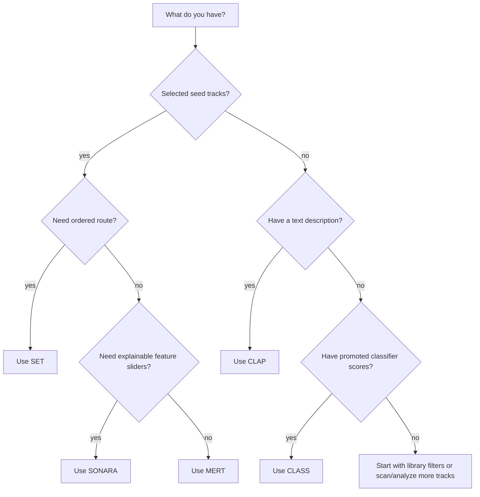

# Find compatible tracks

Audience: DJs choosing a search strategy  
Goal: decide whether to use SONARA, MERT, CLAP, SET, or CLASS  
Type: how-to

The project gives several search surfaces because no single signal is correct
for every DJ task.

## SONARA

Use SONARA when you want feature-oriented search and controls. It is useful for
energy, rhythm, tonal, and other analyzed descriptors.

SONARA search requires stored SONARA features.

## MERT

Use MERT when you have seed tracks and want audio-embedding neighbors. It is a
good default when the question is "what sounds related to this?" rather than
"which tracks match this text?"

MERT seed search requires stored MERT embeddings.

## CLAP

Use CLAP text search when you can describe the target sound in words. Prompts
work best as short musical descriptions, not exact database queries.

CLAP text search requires CLAP embeddings.

## SET

Use SET when you want an ordered preview. SET needs feature-complete candidates:
SONARA plus MERT, MAEST, and CLAP audio embeddings.

## CLASS

Use CLASS after you have promoted a Rhythm Lab classifier profile and scored
the main library for that profile. Missing scores stay neutral.
