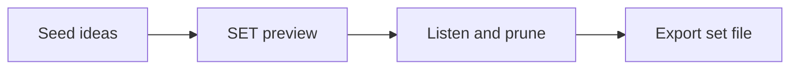

# Prepare a set from a few anchors

> Audience: DJs turning a rough idea into an ordered shortlist.
> Goal: Move from seed tracks to an exportable set preview.
> Type: how-to

Treat the generated set as a shortlist, not a finished performance. The app can order candidates, but your ears still decide whether the transitions, tension, and room energy make sense.

## Flow

- Scan and analyze enough of the library.
- Pick one to five seed tracks.
- Generate a SET preview in balanced or similar-crate mode.
- Tune energy curve, diversity, and BPM mode.
- Preview, prune, then export M3U or CSV.

## Checkpoints

1. Before generating: confirm the seeds represent the set idea and have enough analysis coverage for the search mode you want to use.
2. After generating, listen through the proposed order. Focus first on early transitions, then review the peak section and larger tempo or energy moves.
3. Prune tracks that are technically similar but wrong for the room. Also check vocal density, drum feel, key tension, and personal taste.
4. Before export: check the final count, order, and file availability. Export M3U when your DJ software should load files directly. Export CSV when you want a review sheet.

## Diagram

## Safety

A preview is not a write to audio files. Adding it to the current set is an explicit UI action.
