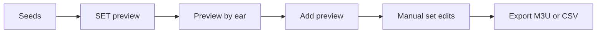

# Prepare a set from a few anchors

> Audience: Users building an ordered listening candidate list.
> Goal: Move from seed tracks to export without treating the preview as final truth.
> Type: workflow

::: warning v7 frontend status
The React workflow below documents the deferred frontend. It has not been ported to the schema-v7
API, so these UI steps are not currently validated or available for v7. Use the backend CLI or API
alternative below.
:::

Use this workflow when you have a few tracks that define a direction but do not yet have a useful
route between them. The result is an editable sequence of candidates: enough structure to begin
rehearsing or crate preparation, without pretending the order is final.

## Current v7 alternative

Use `POST /api/search` or `POST /api/search/sonara` to expand the anchors, then send the chosen track
IDs to `POST /api/set-builder/generate`. Audition returned candidates through
`GET /media/{track_id}`. After listening and manual selection, send the final IDs to
`POST /api/export`. CLAP text search is also available through `dj-sim text-search`. The current
contracts are in the [API reference](../reference/api.md).

## Deferred frontend workflow

The remaining workflow uses the deferred main UI. Expect to remove, replace, and reorder tracks
after listening when the React port becomes available.

## 1. Start with a scanned and analyzed library

For SET, run all core analysis families:

```powershell
dj-sim analyze --models sonara --db .\data\library.sqlite
dj-sim analyze --models maest,mert,clap --db .\data\library.sqlite
```

A track needs SONARA, MERT, MAEST, and CLAP data to be SET-eligible.

## 2. Pick anchors

In the library, search or page to tracks that represent the area you want. Add one to five seeds.

Avoid choosing two tracks from the same known artist for one SET preview. The backend enforces at most one track per known artist.

## 3. Generate a SET preview

Open the SET tab.

- Choose **Manual** if your selected seeds should be fixed anchors.
- Choose **Auto** if you want the app to choose anchors from the eligible library.
- Pick a set mode, energy curve, track limit, and diversity value.
- Use BPM trajectory only when you truly want the set to climb or descend.
- Use classifier preferences only when you understand the promoted classifier.

Click **Generate**. Review the coverage counts and preview order.

## 4. Check alternatives

Use MERT for a broad seed neighborhood. Use SONARA when you want to steer audible feature groups.
Use CLAP when you can describe a missing sound in words. Use Hybrid preview when you want to see
which model sources support a candidate and where transition risk may need attention.

## 5. Listen

Preview candidates by ear. Watch for:

- too many similar tracks,
- artist repetition,
- energy dips or jumps,
- vocal conflicts,
- key or tempo transitions that look fine numerically but feel wrong.

## 6. Add and export

Click **Add preview** only when the preview is useful. Then edit the current set manually and export M3U or CSV.



## Safety

SET generation is read-only. Adding preview changes only the browser's current set state. Export writes a new playlist file, not audio tags.
