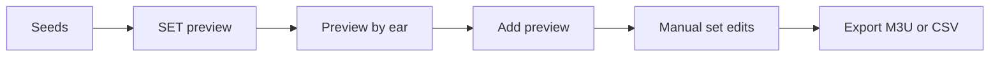

# Prepare a set from a few anchors

> Audience: Users building an ordered listening candidate list.
> Goal: Move from seed tracks to export without treating the preview as final truth.
> Type: workflow

This workflow uses the main UI.

## 1. Start with a scanned and analyzed library

For SET, run all core analysis families:

```powershell
dj-sim analyze --models sonara --db .\data\library.sqlite
dj-sim analyze --models maest,mert,clap --db .\data\library.sqlite
```

A track needs SONARA, MERT, MAEST, and CLAP data to be SET-eligible.

## 2. Pick anchors

In the library, search or page to tracks that represent the area you want. Add one to five seeds.

Avoid choosing two tracks from the same known artist for one SET preview. The backend enforces at most one track per known artist.

## 3. Generate a SET preview

Open the SET tab.

- Choose **Manual** if your selected seeds should be fixed anchors.
- Choose **Auto** if you want the app to choose anchors from the eligible library.
- Pick a set mode, energy curve, track limit, and diversity value.
- Use BPM trajectory only when you truly want the set to climb or descend.
- Use classifier preferences only when you understand the promoted classifier.

Click **Generate**. Review the coverage counts and preview order.

## 4. Check alternatives

Use MERT for close seed neighbors. Use SONARA when you want to steer feature groups. Use CLAP when you can describe a sound in words. Use Hybrid preview when you want weighted source support and diagnostic detail.

## 5. Listen

Preview candidates by ear. Watch for:

- too many similar tracks,
- artist repetition,
- energy dips or jumps,
- vocal conflicts,
- key or tempo transitions that look fine numerically but feel wrong.

## 6. Add and export

Click **Add preview** only when the preview is useful. Then edit the current set manually and export M3U or CSV.



## Safety

SET generation is read-only. Adding preview changes only the browser's current set state. Export writes a new playlist file, not audio tags.
